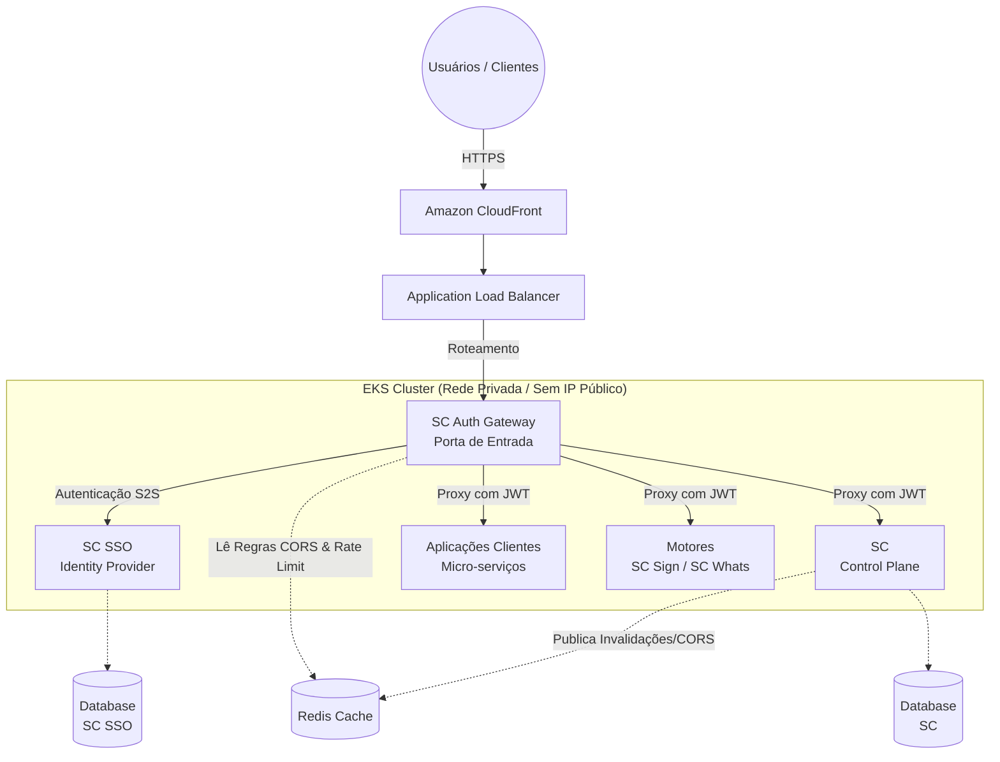

# Plano de Ação: Ecossistema Software Center (SC)

Este documento centraliza as fases de planejamento, os padrões arquiteturais e as diretrizes operacionais para a construção da **SC** (Control Plane), da **SC SSO** (Identity Provider), do **SC Auth Gateway** (Middleware) e das aplicações clientes integradas.

---

## 1. Fases de Planejamento e Documentação

### Fase 1: Prototipação Visual (Pencil / Figma)

- **Telas Nativas de Autenticação:** Desenhar os componentes de login, recuperação de senha e fluxo de MFA nativos no frontend das aplicações clientes (PWA/Vue.js). O objetivo é uma experiência White-label, sem redirecionamentos HTTP 302 visíveis para a SC SSO.
- **Painel de Monitoramento (SC):** Interface na SC para ativar e visualizar em tempo real os logs via WebSocket vindos do Backend e Frontend das aplicações.
- **Gestão de RBAC:** Interface nativa nas aplicações onde o Tenant configurará Cargos e Permissões. A persistência ocorrerá remotamente na SC.

### Fase 2: Modelagem de Dados e API

- **Manifesto de Aplicações:** Definição do JSON que a aplicação envia para a SC informando as rotas do front e permissões de API exigidas.
- **Contratos de API (Swagger/OpenAPI):** Documentação estrita para as integrações Frontend <-> SC AG, SC AG <-> SC e SC AG <-> SC SSO.

---

## 2. Diagramas de Arquitetura (Mermaid)

### A. Topologia de Rede e Deploy (Cloud / EKS)

A arquitetura reflete um ambiente de alta disponibilidade, isolando a rede privada e expondo apenas o Gateway.



### B. Desacoplamento de Bancos de Dados (ERD)

Separação estrita entre Identidade (SC SSO) e Regras de Negócio/Tenants (SC), utilizando Chave Estrangeira Lógica.

```mermaid
erDiagram
    %% Banco de Dados: SC SSO (Identidade)
    namespace DB_SC_SSO {
        USUARIOS {
            bigint id_usuario PK
            string email UK
            string senha_hash
            string status
        }
        OAUTH2_CLIENTS {
            string client_id PK
            string client_secret
        }
    }

    %% Banco de Dados: SC (Control Plane)
    namespace DB_SC {
        TENANTS {
            bigint id_tenant PK
            string subdominio UK
        }
        MEMBROS_TENANT {
            bigint id_membro PK
            bigint id_tenant FK
            bigint id_usuario_logico "Ref Lógica -> USUARIOS"
        }
        APLICACOES {
            bigint id_aplicacao PK
            string nome
        }
        CONTRATOS {
            bigint id_contrato PK
            bigint id_tenant_contratante FK
        }
        CARGOS {
            bigint id_cargo PK
            bigint id_tenant FK
        }
    }

    TENANTS ||--o{ MEMBROS_TENANT : "possui"
    TENANTS ||--o{ CONTRATOS : "assina"
    CONTRATOS ||--o{ APLICACOES : "libera acesso"
    USUARIOS ||--o{ MEMBROS_TENANT : "Vínculo Desacoplado"
```

---

## 3. O Coração da Rede: SC Auth Gateway (SC AG)

A arquitetura abandona os BFFs individuais para cada aplicação em favor de um Middleware Centralizado (SC AG), tornando a plataforma agnóstica de tecnologia para os desenvolvedores terceiros.

### A. Proxy Reverso e Cookie para JWT

1. **Login Transparente:** O Frontend envia as credenciais para o SC AG. O SC AG negocia o JWT internamente com a SC SSO e devolve ao Frontend **apenas um Cookie** (`HttpOnly`, `Secure`).
2. **Roteamento Autenticado:** Nas próximas requisições, o SC AG lê o Cookie, extrai o JWT, injeta no cabeçalho (`Authorization: Bearer`) e repassa para o micro-serviço de destino. O micro-serviço cliente só precisa saber ler um JWT.

### B. CORS Dinâmico e Multi-Tenant via Redis

- A SC não pode ter um CORS estático, pois novos Tenants e subdomínios nascem a todo momento.
- **Fluxo:** A SC registra as origens confiáveis dos contratos no banco e publica essas regras no **Redis**. O SC AG consulta o Redis em milissegundos a cada requisição `OPTIONS` (Preflight) para validar se aquele subdomínio tem permissão de acesso.

---

## 4. Estratégia de Cache e Observabilidade

### A. Invalidação de Cache Inteligente (Redis)

- Para manter a velocidade extrema do SC AG (CORS, Rate Limiting e Metadados), o cache precisa ser responsivo.
- **Estratégia:** Implementação de um método genérico via AOP (Aspect-Oriented Programming) ou Interceptors na SC. Toda vez que um Service executar operações de escrita (`POST`, `PUT`, `PATCH`, `DELETE`) em entidades cacheadas (como Contratos ou Origens Confiáveis), um evento é disparado para invalidar ou atualizar a respectiva chave no Redis automaticamente.

### B. Monitoramento Live (WebSockets)

- Ativação de telemetria sob demanda via painel da SC.
- Quando ativado, os micro-serviços e o Frontend abrem um canal WebSocket reportando *headers*, exceções, IP, provedor e *payloads* em tempo real para a tela do administrador, facilitando o debug sem poluir os logs padrão do servidor.

---

## 5. Ambientes de Execução e Chaves de API

A plataforma opera com identificação autônoma de contexto: o Frontend lê o subdomínio (`cliente.app.com`) e o SC AG repassa isso como `X-Tenant-ID`.

### A. Ambiente de Produção

- **Autenticação S2S:** O SC AG autentica-se na SC SSO usando o `Tenant-ID` + `App-ID` + `API Key do Tenant`.
- **Regras Rigorosas:** Exigência de HTTPS e validação estrita de origens.
- **Rate Limiting Multi-Tenant:** O Redis gerencia bloqueios com a chave `rate_limit:{tenant_id}:{app_id}:{ip}`. Se um funcionário erra a senha na Aplicação A no Tenant X, ele continua acessando o Tenant Y perfeitamente, protegendo a empresa sem travar o usuário para o resto do sistema.

### B. Ambiente de Sandbox (Monetizado)

- Produto comercializado para desenvolvedores terceiros integrarem suas soluções à SC.
- **Regras Afrouxadas:** Chaves de API específicas para Sandbox. Descarte da exigência de HTTPS. Liberação automática de CORS para `http://localhost` e `127.0.0.1`.
- Sem bloqueios de IP agressivos para facilitar automações de testes e desenvolvimento.

---

## 6. Motores / Micro-serviços Nativos

Para reduzir custos de SaaS terceirizados e aumentar o valor da plataforma, a SC contará com "Motores" proprietários integrados:

1. **SC Sign (Assinatura Eletrônica):** Micro-serviço nativo (Custo R$ 0,00). Gera o PDF do contrato, calcula o Hash (SHA-256), captura IP, Timestamp e User-Agent do contratante, gerando um certificado de validade jurídica (MP 2.200-2/2001).
2. **SC Whats (Notificações):** Micro-serviço nativo em Node.js (`whatsapp-web.js` ou `Baileys`) para disparos transacionais gratuitos de códigos MFA, links de assinatura e alertas de sistema.
3. **Gateway de Pagamento (Terceirizado - Iugu/Asaas/Stripe):** A SC apenas orquestra as chamadas via API para faturamento de renovações e assinaturas de sandbox. Nenhuma retenção direta de dados de cartão.
4. **Emissão de NFS-e (Terceirizado - FocusNFe/Asaas):** A complexidade das dezenas de padrões de prefeituras brasileiras é delegada a um parceiro. A SC atua apenas orquestrando os JSONs e gerenciando o status de autorização no seu banco de dados.
