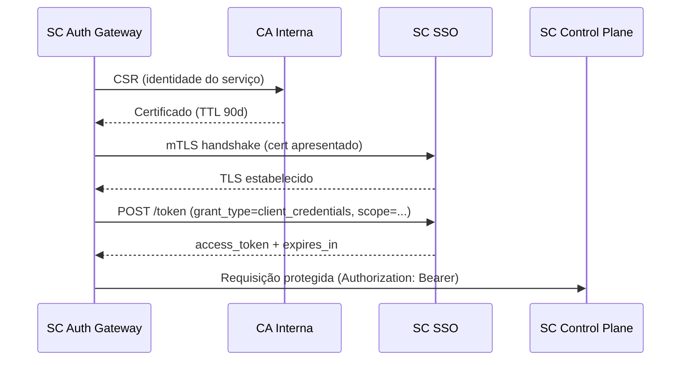
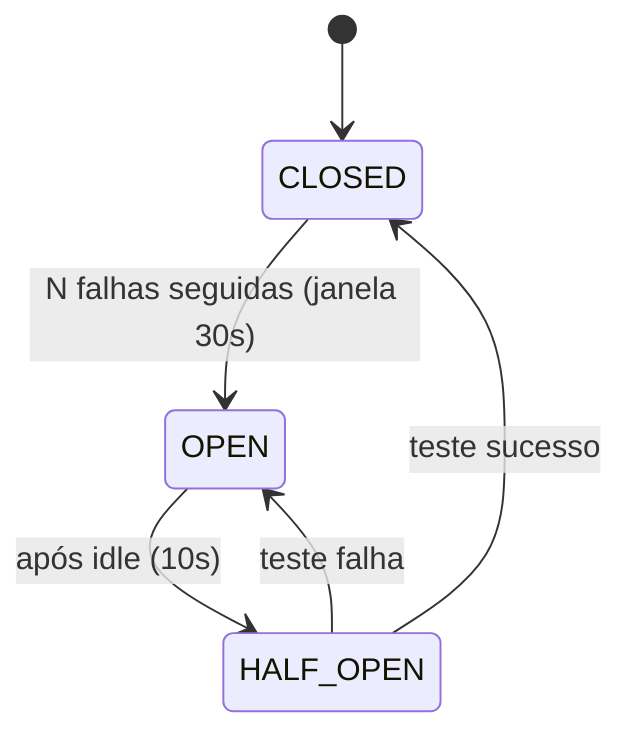
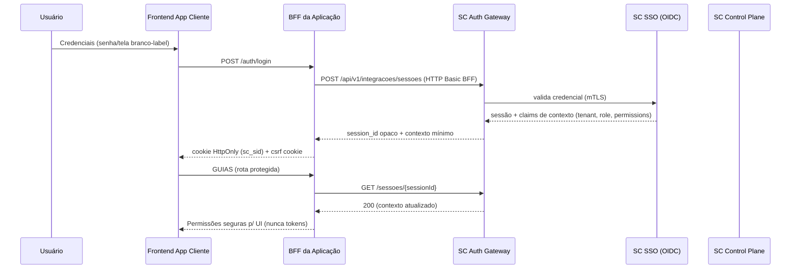
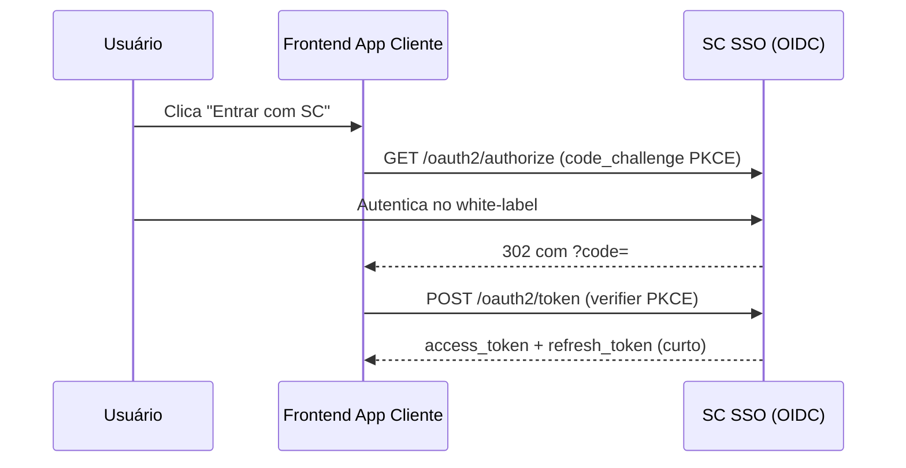
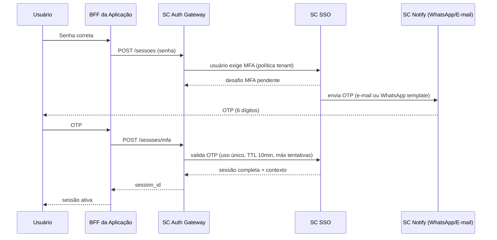
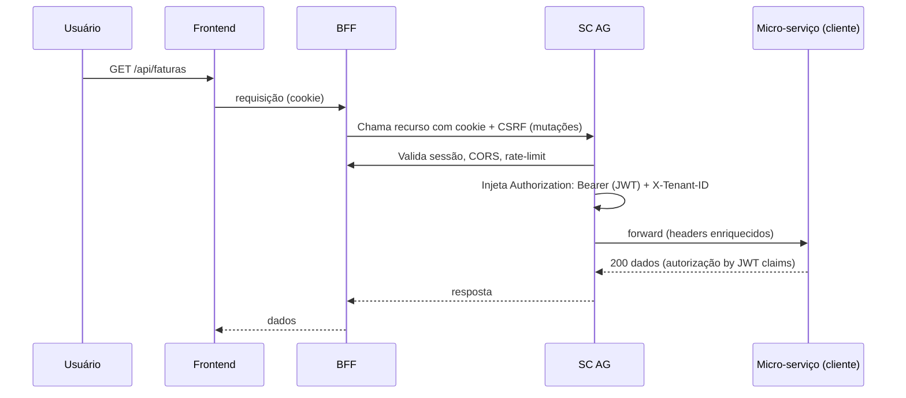

# Plano de Ação V3: Ecossistema Software Center (SC)

| Campo | Valor |
| --- | --- |
| **Documento** | Plano de Ação V3 — Ecossistema Software Center (SC) |
| **Versão** | 3.0 |
| **Status** | Aprovado para implementação (Fase 1 iniciável) |
| **Autor** | Equipe de Arquitetura |
| **Escopo** | SC (Control Plane), SC SSO (Identity Provider), SC Auth Gateway (Middleware), Aplicações Clientes e Motores Nativos |
| **Documentos base** | Plano de Ação V2; Contratos de integração da Software Center (skill `sc`) |

---

## Sumário executivo

A **V3** revisa a arquitetura da V2 incorporando, integralmente, as correções pontuais levantadas na revisão crítica. O ecossistema evolui de um planio conceitual para um **documento executável**: contém princípios, diagramas, fluxos, casos de uso, mapeamento de requisitos rastreáveis (`REQ-xxx`), contratos de API e matrizes de risco.

As mudanças estruturais desta versão:

1. **SC Sign** passa a ser documentada como **Assinatura Eletrônica Qualificada** — força probatória com auditoria completa e evidência forense, com caminho de elevação opcional para assinatura digital ICP-Brasil.
2. **SC Notify** substitui o uso de `whatsapp-web.js`/`Baileys` pela **WhatsApp Business Platform — Cloud API oficial (Meta)**, com custo por conversa, templates aprovados e fallback (e-mail/SMS/push).
3. **SC Auth Gateway** ganha **alta disponibilidade** (múltiplas réplicas), **circuit breaker** e **modo degradado com fallback do Redis**.
4. A comunicação S2S deixa de usar **API Key estática** e passa a usar **mTLS + OAuth2 Client Credentials**.
5. **Cookie de sessão** agora define escopo de domínio e **proteção CSRF** explícita.
6. A **FK lógica entre Identidade e Negócio** ganha política formal de sincronização, soft-delete e reconciliação.
7. **OIDC + PKCE** se torna o mecanismo padrão de autorização de usuários (SSO branco-label).
8. **Telemetria em tempo real** com isolamento rigoroso por tenant no WebSocket.

---

## 1. Visão Geral e Princípios Arquiteturais

### 1.1 Objetivo

Construir o **control plane de software** da organização: identidade central, multi-tenancy, RBAC, catálogo de aplicações, contratos de liberação de acesso e uma faixa de motores de negócio nativos — tudo servido por um gateway de autenticação centralizado (SC AG) que torna a plataforma **agnóstica de tecnologia** para desenvolvedores terceiros.

### 1.2 Princípios (ADR)

| # | Princípio | Decisão | Trade-off aceito |
| --- | --- | --- | --- |
| P-01 | **Gateway centralizado** | Um único middleware (SC AG) para autenticação, autorização, CORS e rate limit | SC AG é ponto de entrada; exige HA e circuit breaker (mitigado em §5.3) |
| P-02 | **Identidade desacoplada** | Identidade fica na SC SSO; negócio/tenants ficam na SC; vínculo por FK lógica | Integridade referencial exige sincronização (política em §4.3) |
| P-03 | **Zero confiança no navegador** | Nenhum token, segredo ou credencial chega ao browser; só cookie HttpOnly + CSRF | Requer CSRF e cookies escopados (§5.2) |
| P-04 | **S2S sem segredos estáticos** | mTLS + OAuth2 Client Credentials no lugar de API Keys | Custo operacional de gerenciar certificados (§5.1) |
| P-05 | **CORS/rate-limit dinâmicos** | Regras publicadas no Redis pela SC e lidas pelo SC AG em tempo real | Dependência de cache — exige TTL, versão e fallback (§5.4) |
| P-06 | **RBAC como declaração** | Permissões declaradas em Manifesto e efetivadas no backend do consumidor | Renomear chave = quebrar acesso (convenção `group.acao.entidade`) |
| P-07 | **Observabilidade sob demanda** | Telemetria live via WebSocket só quando ativada; isolamento por tenant | Custo de canais permanentes quando ativos (§12) |

---

## 2. Mudanças Críticas — V2 → V3

| # | Tema V2 | Problema identificado | Correção implementada na V3 | Seção |
| --- | --- | --- | --- | --- |
| C-01 | SC Sign "validade jurídica (MP 2.200-2)" | MP 2.200-2 refere-se a assinatura **digital** ICP-Brasil; hash SHA-256 + metadados dão força probatória, não plena | Assinatura **Eletrônica Qualificada**, com log assinado, timestamp RFC 3161 (TSA), e validação forense; elevação opcional ICP-Brasil | §14.1 |
| C-02 | SC Whats com `whatsapp-web.js`/`Baileys` | Violam Termos do WhatsApp; risco de banimento; sem garantia de entrega | **WhatsApp Cloud API oficial (Meta)**, templates aprovados, custo por conversa, fallback e-mail/SMS | §14.2 |
| C-03 | Cookie JWT sem CSRF/escopo | Cookie é vetor de CSRF; escopo de domínio indefinido | `SameSite=Lax/Strict`, flag de escopo por domínio e **double-submit token CSRF** | §5.2 |
| C-04 | Single SC AG | SPOF; derruba todas as apps juntas | Replicação ≥2 em AZ distintas, health checks, **circuit breaker** e modo degradado | §5.3 |
| C-05 | Redis sem fallback | Se o Redis cair, CORS/rate-limit quebram | Cache local (in-memory) como reserve, TTL curto, versões de chave e grace period | §5.4 |
| C-06 | API Key Tenant S2S | Vaza em logs; rotação manual; sem revogação granular | **mTLS** (CA interna) + `client_credentials` com escopo mínimo e rotação automática | §5.1 |
| C-07 | FK lógica sem política | Usuário excluído na SSO deixa órfão o negócio | Ciclo de vida definido: eventos, soft-delete, reconciliação, stub de identidade | §4.3 |
| C-08 | WebSocket cross-tenant | Risco de vazamento de logs de um tenant no painel de outro | Handshake autorizado, tópicos por tenant, retenção escopada, redação de segredos | §12 |
| C-09 | OAuth2 sem PKCE (implícito) | Sem PKCE = token exposto na URL de redirect | **OIDC `authorization_code` + PKCE**, refresh token rotativo | §6.1 |
| C-10 | Cache só com invalidação | Consistência frágil em picos | TTL por chave + versão de esquema + invalidação via AOP/eventos (retido da V2) | §5.4 |

---

## 3. Componentes do Ecossistema

| Componente | Papel | Tecnologia sugerida | Dono |
| --- | --- | --- | --- |
| **SC** | Control Plane: tenants, contratos, RBAC, catálogo, motores | Java 21 + Spring Boot 3 + JPA + Flyway | Equipe SC |
| **SC SSO** | Identity Provider (OIDC Authorization Server) | Spring Authorization Server + PostgreSQL | Equipe SC |
| **SC AG** | Auth Gateway: proxy reverso, cookies, CORS dinâmico, rate-limit, mTLS | Spring Cloud Gateway (replicado) | Equipe SC |
| **SC Portal (painel)** | Admin do tenant: gestão de membros, RBAC, liberações, monitoramento | Vue 3 + Vuetify + Pinia | Equipe SC |
| **Aplicações Clientes** | Produtos de terceiros integrados via BFF + cookie | Agnóstica (Vue/PWA/React/mobile) | Devs terceiros |
| **Motores** | SC Sign, SC Notify, Gateway de Pagamento, NFS-e | Node/Java + API externa | Equipe SC + parceiros |
| **Infraestrutura** | Proxy CDN, balanceamento, Redis, bancos, WebSocket | AWS CloudFront + ALB + EKS + ElastiCache + RDS | DevOps |

---

## 4. Diagramas de Arquitetura (Mermaid)

### 4.1 Topologia de Rede e Deploy (HA)

```mermaid
graph TD
    User((Usuários / Clientes)) -->|HTTPS| CF[Amazon CloudFront]
    CF --> ALB[Application Load Balancer<br/>Multi-AZ]
    ALB -->|Roteamento| AG1[SC Auth Gateway - Réplica 1]
    ALB -->|Roteamento| AG2[SC Auth Gateway - Réplica 2]

    subgraph "EKS Cluster (Rede Privada / Sem IP Público)"
        AG1 -->|mTLS + Client Credentials| SCSSO[SC SSO<br/>Identity Provider<br/>OIDC + PKCE]
        AG1 -->|mTLS + Client Credentials| SC[SC<br/>Control Plane]
        AG2 -->|mTLS + Client Credentials| SCSSO
        AG2 -->|mTLS + Client Credentials| SC
        AG1 -->|Proxy JWT| APPS[Aplicações Clientes<br/>BFF + Micro-serviços]
        AG2 -->|Proxy JWT| APPS
        AG1 -->|Proxy JWT| MOTORES[Motores<br/>SC Sign / SC Notify]
        AG2 -->|Proxy JWT| MOTORES
    end

    AG1 -.->|Lê CORS, Rate-Limit, Versão| Redis[(Redis / ElastiCache<br/>Multi-AZ)]
    AG2 -.->|Lê CORS, Rate-Limit, Versão| Redis
    SC -.->|Publica Invalidações/CORS (PUBLISH)| Redis
    SC -.->|Fallback local cache| AG1
    SC -.->|Fallback local cache| AG2

    SCSSO -.-> DB_SSO[(Database<br/>SC SSO)]
    SC -.-> DB_SC[(Database<br/>SC)]
    MOTORES -.-> DB_MOTOR[(Database<br/>Motores e Auditoria)]
```

### 4.2 Modelo de Dados — Identidade × Negócio (ERD)

Separação estrita entre **Identidade (SC SSO)** e **Regras de Negócio/Tenants (SC)**, com Chave Estrangeira **Lógica** formalizada (§4.3).

```mermaid
erDiagram
    %% Banco de Dados: SC SSO (Identidade)
    namespace SC_SSO {
        USUARIOS {
            bigint id_usuario PK
            string email UK
            string senha_hash
            string status "PENDING|ACTIVE|BLOCKED"
            datetime email_verificado_em
            datetime excluido_em "Soft delete"
        }
        OAUTH2_CLIENTS {
            string client_id PK
            string client_secret
            string[] redirect_uris
            string[] post_logout_redirect_uris
            string[] origens_cors
        }
        AUTH_SESSIONS {
            string session_id PK "Opaco"
            bigint id_usuario FK
            string client_id FK
            datetime expires_at
            string redirect_ack
        }
        REFRESH_TOKENS {
            string refresh_token PK "Hash"
            bigint id_usuario FK
            datetime expires_at
            datetime rotated_at
            string family_id
        }
        MFA_CHALLENGES {
            string challenge_id PK
            bigint id_usuario FK
            string channel "EMAIL|WHATSAPP|TOTP"
            string secret_hash
            datetime expires_at
            int tentativas
        }
    }

    %% Banco de Dados: SC (Control Plane)
    namespace SC {
        TENANTS {
            bigint id_tenant PK
            string subdominio UK
            string razao_social
            boolean ativo
        }
        MEMBERSHIPS {
            bigint id_membership PK
            bigint id_tenant FK
            bigint id_usuario_logico "FK Lógica -> USUARIOS.id_usuario"
            string papel "OWNER|ADMIN|MEMBER"
            string status "PENDING|ACTIVE|BLOCKED"
            datetime excluido_em "Soft delete"
        }
        APLICACOES {
            bigint id_aplicacao PK
            string application_key UK
            string nome
            boolean exclusiva
            bigint id_tenant_beneficiario_exclusivo
        }
        PERMISSOES {
            bigint id_permissao PK
            bigint id_aplicacao FK
            string chave UK "group.acao.entidade"
            string nome
            string grupo
            string icone
        }
        ROTAS {
            bigint id_rota PK
            bigint id_aplicacao FK
            string kind "FRONTEND|API"
            string method
            string path
            bigint id_permissao FK
        }
        CARGOS {
            bigint id_cargo PK
            bigint id_tenant FK
            bigint id_aplicacao FK
            string nome
            string icone
            boolean break_glass
        }
        ATRIBUICOES {
            bigint id_atribuicao PK
            bigint id_membership FK
            bigint id_cargo FK
        }
        CONTRATOS {
            bigint id_contrato PK
            bigint id_tenant_contratante FK
            bigint id_aplicacao FK
            string status "ATIVO|SUSPENSO|VENCIDO"
            datetime vigencia
        }
        ORIGENS_CONFIAVEIS {
            bigint id_origem PK
            bigint id_contrato FK
            string origem "scheme://host:porta"
            datetime ativa_desde
        }
        EVENTOS_SINCRONIA {
            bigint id_evento PK
            string tipo "USER_CREATED|USER_BLOCKED|USER_SOFT_DELETED"
            bigint id_usuario_logico
            datetime ocorrido_em
            string status "PENDENTE|PROCESSADO|FALHO"
        }
        AUDITORIA_ASSINATURAS {
            bigint id_auditoria PK
            bigint id_assinatura FK
            string sha256_documento
            string ip
            string user_agent
            datetime timestamptsa
        }
    }

    TENANTS ||--o{ MEMBERSHIPS : "possui"
    TENANTS ||--o{ CONTRATOS : "assina"
    CONTRATOS ||--o{ ORIGENS_CONFIAVEIS : "declara origens"
    APLICACOES ||--o{ PERMISSOES : "declara permissões"
    APLICACOES ||--o{ ROTAS : "expõe rotas"
    TENANTS ||--o{ CARGOS : "define"
    APLICACOES ||--o{ CARGOS : "define"
    MEMBERSHIPS ||--o{ ATRIBUICOES : "recebe"
    CARGOS ||--o{ ATRIBUICOES : "concede"
    USUARIOS ||--o{ MEMBERSHIPS : "Vínculo Desacoplado (FK Lógica)"
    USUARIOS ||--o{ MFA_CHALLENGES : "desafia"
    USUARIOS ||--o{ AUTH_SESSIONS : "autentica"
    USUARIOS ||--o{ REFRESH_TOKENS : "renova"
```

### 4.3 Política de FK Lógica — Ciclo de Vida de Identidade

O vínculo `MEMBERSHIPS.id_usuario_logico → USUARIOS.id_usuario` é **lógico**: a SC não enxerga dados da SC SSO, apenas o identificador.

| Evento na SC SSO | Ação na SC | Ação nos memberships |
| --- | --- | --- |
| `USER_CREATED` | Cria stub em `EVENTOS_SINCRONIA` | — |
| `USER_ACTIVATED` | Marca pendências como processadas | Separa membros `PENDING`? Ativa acesso |
| `USER_BLOCKED` | Marca como bloqueado localmente | `MEMBERSHIPS.status = BLOCKED` |
| `USER_SOFT_DELETED` | Reconciliador remove o stub | `MEMBERSHIPS.excluido_em = now` (soft-delete, preserva auditoria) |
| `USER_MERGED` (reparo) | Atualiza `id_usuario_logico` | Executa replace controlado |

Regras:

- **Soft-delete sempre**: nunca `DELETE` físico; preserva contratos, auditoria e atribuições históricas.
- **Reconciliador diário**: comparativo de `id_usuario_logico` ativos vs. `PROCESSADO`; gera alerta em divergência.
- **Exclusão**: usuário soft-deletado perde acesso imediatamente (membership inativado), mas o histórico permanece íntegro.
- **Reprovisionamento**: novo cadastro de e-mail igual recebe **novo `id_usuario`** — o vínculo antigo permanece histórico.

---

## 5. Segurança — Matriz de Ameaças e Mitigações

| Ameaça | Vetor | Risco | Mitigação | Criticidade |
| --- | --- | --- | --- | --- |
| Exfiltração de token JWT | XSS no frontend | Alta | Tokens só no backend/BFF; cookie HttpOnly; CSP rígido | CRÍTICA |
| CSRF (cookie de sessão) | Requisição forjada | Alta | `SameSite=Lax`/`Strict` + **double-submit token** em `X-CSRF-Token` | CRÍTICA |
| Replay de token | Rede/Proxy | Alta | JWT com `jti` único, TTL curto, `aud`/`iss` verificados | ALTA |
| Vazamento de segredo S2S | Logs, repositório | Alta | **mTLS** + `client_credentials`; segredos só em cofre (nunca em logs/pipeline) | CRÍTICA |
| Banimento de número WhatsApp | Uso não oficial | Alta | Cloud API oficial; templates aprovados; limites de throughput | ALTA |
| Vazamento cross-tenant (WebSocket) | Canal sem isolamento | Alta | Tópico por tenant + validação no handshake + redação de secrets | CRÍTICA |
| Enumeração de usuários | Mensagens de erro distintas | Média | Respostas genéricas (`202`/`401` uniformes) | ALTA |
| Brute-force de senha | Login | Alta | Rate limit multi-tenant por `tenant:app:ip`; lockout progressivo | ALTA |
| Acesso a dados de outro tenant | Erro de escopo no BFF | Alta | `tenant_subdomain` no contexto; BFF nunca confia no browser | CRÍTICA |
| Replay de OTP/MFA | OTP capturado | Média | OTP de uso único, TTL 10 min, limite de tentativas | ALTA |

### 5.1 Autenticação Service-to-Service (mTLS + OAuth2)

Substitui a API Key estática da V2.

| Requisito | Decisão |
| --- | --- |
| Identidade do chamador | Certificado X.509 emitido por **CA interna** (procedimento de emissão, revogação e rotação automática) |
| Autorização | OAuth2 **`client_credentials`** com escopo mínimo (`sc.catalog.sync`, `sc.rbac.read`, `sc.rbac.write`) |
| Validação | PIN (pública) só no TLS; assinatura do JWT por JWKS do SC SSO |
| Rotação | Certificados de curta duração (≤90 dias) com rotina automática via secret manager |
| Revogação | CRL/OCSP; revogação imediata em incidente |
| Logs | Nunca registrar segredo, key ou certificado privado |

Fluxo de bootstrap do túnel S2S:



### 5.2 Cookie de Sessão + CSRF

| Propriedade | Valor |
| --- | --- |
| Nome | `sc_sid` (opaco; sem JWT no cookie em apps web) |
| HttpOnly | Sim |
| Secure | Sim (HTTPS obrigatório; exceto sandbox localhost) |
| SameSite | `Lax` (padrão) / `Strict` para fluxos HTML |
| Domínio | **Escopado por subdomínio** da app (`app.exemplo.com`), nunca wildcard `.com` — só `.:` compartilhado se SSO multi-app exige, com `__Host-` prefix |
| Rotation | Cookie de sessão rotaciona a cada revalidação/autorização |
| CSRF | **Double-submit token**: valor não-guessable em `X-CSRF-Token` espelhado em cookie separado (`sc_csrf`, não-HttpOnly); validado no SC AG para mutações |
| Expiração | Síncrona com a sessão da SC; logout revoga `session_id` e remove cookie |

> **Limitação formalizada (skill `sc`):** a revalidação **não renova** a expiração da sessão na SC. Se `401`, o BFF deve encerrar a sessão local imediatamente.

### 5.3 Alta Disponibilidade e Circuit Breaker (SC AG)

| Cenário | Comportamento |
| --- | --- |
| Réplica do SC AG falha | ALB remove do pool via health check; réplicas ≥2 em AZ distintas |
| Redis indisponível | **Modo degradado**: SC AG usa **cache local** (TTL curto de minutos) com as últimas regras CORS/rate-limit; grava `EVENTOS` para re-sincronização; alerta P1 |
| SC SSO indisponível | SC AG mantém sessões válidas em cache de autorização (grace); novas autenticações rejeitadas com `503` |
| Circuit broken (downstream) | Após N falhas em janela, abre circuit; retorna `503` com `Retry-After`; half-open após idle |
| Timeout | Timeouts curtos no proxy; fallbacks rápidos; nunca travar requisição |



### 5.4 CORS Dinâmico e Rate Limiting com Fallback

**CORS dinâmico:** a SC registra origens confiáveis dos contratos no banco e publica no Redis. Chamadas `OPTIONS` (Preflight) consultam o SC AG em milissegundos.

- **TTL por chave**: `cors:{tenant}:{app}` TTL 5 min; `rate_limit:{tenant}:{app}:{ip}` janela deslizante.
- **Versão de esquema**: chaves versionadas (`schema:v1:...`) para invalidar tudo de uma vez em mudança estrutural.
- **Invalidação via AOP**: interceptor/ponto de corte na SC detecta escrita em entidades cacheadas (`POST/PUT/PATCH/DELETE`) e dispara `PUBLISH invalidate` no Redis.
- **Fallback local**: cache em memória no SC AG como reserva quando Redis falha (§5.3).

Repositório de regras:

```text
Redis
├── cors:schema:v1:{tenant_subdomain}:{app_key}     -> ["https://app.exemplo.com"]
├── rate:schema:v1:{tenant_subdomain}:{app_key}     -> { permit: 100, window: 60, burst: 20 }
├── rate:local:{tenant}:{app}:{ip}                  -> contador de janela deslizante
└── cdn:origin:allowlist                            -> versão hash para CloudFront (CDN-level)
```

**Rate Limit Multi-Tenant (retido da V2):** bloqueio por `tenant:app:ip`. Um funcionário do Tenant X que erra a senha na Aplicação A **continua acessando** o Tenant Y — protege a empresa sem travar o usuário globalmente.

---

## 6. Fluxos Detalhados

### 6.1 Login com OIDC + PKCE (SSO Branco-label)



Fluxo equivalente via `authorization_code + PKCE` quando a app usa OIDC nativo:



### 6.2 MFA



### 6.3 Logout e Revogação

1. Usuário solicita logout no BFF.
2. BFF chama `DELETE /api/v1/integracoes/sessoes/{sessionId}` (idempotente, retorna `204`).
3. BFF remove cookie `sc_sid` e `sc_csrf`.
4. SC AG revoga o `auth_session` e a família de refresh tokens associada.
5. Qualquer revalidação subsequente retorna `401` e encerra sessões locais.

### 6.4 Requisição Autenticada via Proxy (SC AG → Micro-serviço)



> O micro-serviço cliente **só precisa saber ler um JWT** — não conhece cookie, SSO nem Redis.

---

## 7. Casos de Uso

### 7.1 Catálogo de Casos de Uso

| ID | Nome | Ator principal | Pré-condição | Fluxo principal (resumo) | Exceções | Relação com REQ |
| --- | --- | --- | --- | --- | --- | --- |
| UC-001 | Login com senha (branco-label) | Usuário final | Identidade ACTIVE, e-mail verificado | Envia credenciais ao BFF → SC AG cria sessão → cookie HttpOnly | 401/429/503; `PENDING`, e-mail não verific. | REQ-001 |
| UC-002 | Login com Google | Usuário final | Google configurado na SC | Envia `id_token` ao BFF → SC valida audience/issuer/email_verified | 503 se não configurado | REQ-002 |
| UC-003 | MFA via WhatsApp/E-mail | Usuário final | Política do tenant exige MFA | Senha ok → OTP → sessão completa | OTP expirado/limite de tentativas | REQ-003 |
| UC-004 | Recuperação de senha | Usuário final | E-mail existe (resposta genérica) | Solicita → OTP por e-mail → redefine | `202` sempre, mesmo e-mail inexistente; OTP 10min | REQ-004 |
| UC-005 | Cadastro e ativação de conta | Usuário final / Admin | — | `POST /public/cadastro` → e-mail de verificação → ACTIVE | Token expirado/inválido | REQ-005 |
| UC-006 | Provisionamento de acesso | Admin (OWNER/ADMIN) | Membership com aprovisionamento permitido | Publica provisionamento → link de ativação único (7d) → cargo inicial | Token expirado; e-mail diferente ao aceitar | REQ-006, REQ-RBAC |
| UC-007 | Gestão de RBAC (cargos/permissões) | Admin | Capability `RBAC_MANAGE` | Token delegado `sc-management` → CRUD cargos/atribuições | Não delega permissão superior à efetiva; sem inativação de cargo na API atual | REQ-RBAC |
| UC-008 | Onboarding de aplicação via Manifesto | Dev terceiro / automação | Aplicação cadastrada; credencial catálogo | Prévia → diff → aplicar (hash) → exportar | Desvio de schema/hash; renomear permissão = nova chave | REQ-MAN |
| UC-009 | Contrato de liberação de acesso | Admin SC | Contrato assinado; origem confiável | Publica origens no Redis → CORS dinâmico | Origem sem contrato ativo | REQ-009 |
| UC-010 | Assinatura eletrônica qualificada | Usuário final autenticado | Contrato gerado | Gera PDF → hash SHA-256 → TSA RFC3161 → registra auditoria | Falha na TSA; rejeição de hash | REQ-SIGN |
| UC-011 | Notificação transacional (WhatsApp/E-mail) | Sistema (SC Notify) | Template aprovado; usuário opt-in | Enfileira → entrega via Cloud API → webhook de status | Fila retry; falha final → fallback e-mail | REQ-NOT |
| UC-012 | Monitoramento live de logs | Admin (perfil monitor) | Sessão com permissão `observability.read` | Ativa telemetria → canal WebSocket por tenant → stream redigido | Sem permissão = sem canal; nunca logs de outro tenant | REQ-OBS |
| UC-013 | Ativação de aplicação exclusiva | Admin SC | Aplicação `exclusiva=true`, tenant beneficiário ativo | Nega contratos para outros tenants; SC resolve tenant beneficiário | Tentativa de habilitar exclusividade com liberações ativas | REQ-010 |
| UC-014 | Login em aplicação exclusiva | Usuário final | Membership no tenant beneficiário | BFF omite `tenantSubdominio`; SC resolve contexto | Membro sem cargo ativo no beneficiário → 403 | REQ-010 |
| UC-015 | Sandbox para devs terceiros | Dev terceiro | Chave sandbox válida | CORS localhost liberado; sem rate-limit agressivo; sem exigência HTTPS | Key expirada/revogada | REQ-SBX |

### 7.2 Exemplo expandido — UC-007 Gestão de RBAC

- **Ator:** Admin do tenant com capability `RBAC_MANAGE`.
- **Pré-condições:** Sessão válida no tenant; aplicação ativa; cargo destino dentro do tenant.
- **Fluxo principal:**
  1. BFF troca token de usuário por **token delegado** (audience `sc-management`, scope `sc.rbac.*`).
  2. `GET /api/v1/integracoes/rbac/aplicacoes/{idApp}/permissoes` → lista permissões do manifesto ativo.
  3. `POST .../cargos` cria cargo com `idsPermissoes`.
  4. `POST .../atribuicoes` vincula `idMembroTenant` + `idCargo`.
- **Pós-condição:** Novo cargo aparece no contexto da próxima sessão/jwt do membro.
- **Exceções:**
  - Cargo com permissão que o ator não possui → rejeitado.
  - `breakGlass=false` — requer justificativa; `breakGlass=true` só munido de política de exceção.
  - API atual **não** expõe inativação/reativação de cargo (`PATCH /status` não existe). Mitigação: versionar no manifesto (remover permissão = inativa), nunca omitir sem avaliar cargos.

---

## 8. Mapeamento de Requisitos (Rastreável)

### 8.1 Requisitos Funcionais

| ID | Requisito | Prioridade (MoSCoW) | Módulo | Caso de uso | Fase |
| --- | --- | --- | --- | --- | --- |
| REQ-001 | Login por senha com sessão BFF e cookie seguro | Must | SC AG + SC SSO | UC-001 | 1 |
| REQ-002 | Login com Google (id_token validado) | Must | SC SSO | UC-002 | 2 |
| REQ-003 | MFA com canais configuráveis (TOTP/WhatsApp/E-mail) | Must | SC SSO + SC Notify | UC-003 | 2 |
| REQ-004 | Recuperação de senha com OTP (anti-enumeração) | Must | SC SSO | UC-004 | 1 |
| REQ-005 | Cadastro público + verificação de e-mail | Must | SC SSO | UC-005 | 1 |
| REQ-006 | Provisionamento por admin com link de ativação único | Must | SC SSO + SC | UC-006 | 1 |
| REQ-007 | Manifesto de aplicação (prévia + aplicar + exportar) | Must | SC (catálogo) | UC-008 | 2 |
| REQ-008 | CORS dinâmico por contrato publicado no Redis | Must | SC + SC AG | UC-009 | 2 |
| REQ-009 | Rate limit multi-tenant por `tenant:app:ip` | Must | SC AG | UC-015 | 2 |
| REQ-010 | Aplicação exclusiva (tenant beneficiário fixo) | Should | SC | UC-013/014 | 3 |
| REQ-011 | Token delegado para gestão de RBAC | Must | SC SSO + SC | UC-007 | 2 |
| REQ-012 | mTLS + client_credentials para S2S | Must | Todos | — | 1 |
| REQ-013 | Circuit breaker e fallback Redis no SC AG | Must | SC AG | — | 1 |
| REQ-014 | Rotação automática de certificados/cookies | Should | Infra | — | 2 |
| REQ-015 | WebSocket de telemetria isolado por tenant | Should | SC + apps | UC-012 | 3 |

### 8.2 Requisitos Não Funcionais

| ID | Requisito | Meta | Verificação |
| --- | --- | --- | --- |
| NFR-01 | Disponibilidade | 99,9% (HA multi-AZ) | SLO no dashboard |
| NFR-02 | Latência de preflight CORS | P99 < 10 ms (Redis) | k6/garrafa |
| NFR-03 | Latência de proxy do SC AG | P99 < 50 ms overhead | trace distribuído (OpenTelemetry) |
| NFR-04 | Segurança de segredos | 0 segredo em logs/repo | SonarQube + scan de secrets |
| NFR-05 | Isolamento de tenant | Acesso cross-tenant = falha de teste | testes de penetração multi-tenant |
| NFR-06 | Rastreabilidade de auditoria (assinaturas) | 100% dos eventos registrados | trilha de auditoria imutável |
| NFR-07 | Tempo de recuperação (RTO) | ≤ 15 min após falha de AZ | game day mensal |
| NFR-08 | Ponto de recuperação (RPO) | ≤ 5 min (backup contínuo + WAL) | simulação de restauro |

### 8.3 Requisitos de Domínio SC (contrato real — skill `sc`)

| ID | Regra herdada do contrato SC |
| --- | --- |
| DR-01 | Browser nunca recebe senha, access/refresh token, segredo ou `sessionId` |
| DR-02 | Identidade tem status `PENDING/ACTIVE/BLOCKED`; login exige `ACTIVE` + e-mail verificado |
| DR-03 | Membership com papel `OWNER/ADMIN/MEMBER`; admin tem capabilities `MEMBERS_MANAGE` e `RBAC_MANAGE` |
| DR-04 | Aplicação exclusiva exige `idTenantBeneficiarioExclusivo` ≠ tenant owner; contratos para outros tenants são rejeitados |
| DR-05 | Sessão válida só quando identidade + membership + tenant + aplicação + recurso + contrato + atribuição + cargo + permissões estão ativos |
| DR-06 | `tenantSubdominio` obrigatório só para aplicações não exclusivas |
| DR-07 | Credencial BFF usa HTTP Basic; segredo só aparece em texto claro na rotação |
| DR-08 | Falhas de login são genéricas: nunca revele a causa (senha/usuário/tenant/regra) |
| DR-09 | Sessão do painel SC não compartilha cookie com apps clientes |
| DR-10 | CORS da app só quando a origem estiver cadastrada para aplicação ativa (nada de allowlist global) |

---

## 9. Contratos de API (OpenAPI — visão consolidada)

### 9.1 Identidade / Sessão (via BFF, HTTP Basic da credencial BFF)

| Método | Endpoint | Descrição | Resposta principal |
| --- | --- | --- | --- |
| POST | `/api/v1/integracoes/sessoes` | Cria sessão com senha | `201` + `sessionId` + contexto |
| POST | `/api/v1/integracoes/sessoes/google` | Cria sessão com Google | idem; `503` se Google não configurado |
| GET | `/api/v1/integracoes/sessoes/{sessionId}` | Revalida sessão | `200` contexto / `401` (revogar local) |
| DELETE | `/api/v1/integracoes/sessoes/{sessionId}` | Revoga sessão | `204`, idempotente |
| POST | `/api/v1/public/cadastro` | Cadastra identidade `PENDING` | `201` |
| POST | `/api/v1/public/verificacoes-email` | Verifica e-mail | ativa identidade |
| POST | `/api/v1/public/recuperacoes-senha` | Solicita recuperação (sempre `202`) | `202` genérico |
| POST | `/api/v1/public/recuperacoes-senha/verificacoes` | Valida OTP | OK / inválido |
| POST | `/api/v1/public/redefinicoes-senha` | Redefine senha (encerra sessões/autorizações) | OK |
| POST | `/api/v1/tenants/contexto-atual/provisionamentos` | Provisiona acesso (admin) | `202` + link ativação |
| GET | `/api/v1/public/ativacoes-acesso/{token}` | Consulta ativação | dados seguros (e-mail mascarado) |
| POST | `/api/v1/public/ativacoes-acesso/{token}/cadastro` | Completa cadastro/ativa membership | OK |
| POST | `/api/v1/ativacoes-acesso/{token}/aceite` | Aceita ativação autenticado | OK (e-mail deve casar) |

### 9.2 RBAC (token delegado `sc-management`)

| Método | Endpoint | Scope |
| --- | --- | --- |
| GET | `/api/v1/integracoes/rbac/aplicacoes/{idApp}/membros` | `sc.members.read` |
| GET | `/api/v1/integracoes/rbac/aplicacoes/{idApp}/permissoes` | `sc.rbac.read` |
| GET | `/api/v1/integracoes/rbac/aplicacoes/{idApp}/cargos` | `sc.rbac.read` |
| GET | `/api/v1/integracoes/rbac/aplicacoes/{idApp}/atribuicoes` | `sc.rbac.read` |
| POST | `/api/v1/integracoes/rbac/aplicacoes/{idApp}/cargos` | `sc.rbac.write` |
| PUT | `/api/v1/integracoes/rbac/aplicacoes/{idApp}/cargos/{idCargo}` | `sc.rbac.write` |
| POST | `/api/v1/integracoes/rbac/aplicacoes/{idApp}/atribuicoes` | `sc.rbac.write` |

> Token delegado exige capability `RBAC_MANAGE` no token de origem, `application_id` igual ao recurso no path e TTL curto.

### 9.3 Catálogo / Manifesto (token técnico `sc-catalog`)

| Método | Endpoint | Descrição |
| --- | --- | --- |
| POST | `/api/v1/integracoes/catalogo/aplicacoes/{idApp}/manifestos` | Prévia do manifesto → `diferencas` + `idManifesto` + `hash` |
| POST | `/api/v1/integracoes/catalogo/aplicacoes/{idApp}/manifestos/{idManifesto}/aplicar` | Aplica prévia (body `{ "hash" }`) |
| GET | `/api/v1/integracoes/catalogo/aplicacoes/{idApp}/manifesto` | Exporta estado ativo |
| POST | `/api/v1/aplicacoes/{idAplicacao}/clientes-oidc` | Cadastra cliente OIDC (clientId, secret, redirects, origens CORS) |

### 9.4 Interpretação de estados de erro (padrão SC)

| Status | Significado | Ação do BFF |
| --- | --- | --- |
| `401` | Credencial BFF/sessão inválida | Encerra sessão local; exige login |
| `403` | Autenticado sem acesso efetivo | Não expor motivo específico |
| `429` | Rate limit | Respeitar `Retry-After`; feedback genérico |
| `503` | Provedor (Google/WhatsApp/TSA) indisponível | Oferecer alternativa |

---

## 10. Manifesto de Aplicação (Schema)

```json
{
  "schemaVersion": 1,
  "applicationKey": "invoice",
  "version": "1.0.0",
  "permissions": [
    {
      "key": "invoice.facturas.read",
      "name": "Consultar faturas",
      "description": "Permite consultar faturas.",
      "group": "Faturas",
      "icon": "mdi-file-document-outline"
    },
    {
      "key": "invoice.facturas.write",
      "name": "Emitir faturas",
      "description": "Permite emitir e editar faturas.",
      "group": "Faturas",
      "icon": "mdi-file-edit-outline"
    }
  ],
  "routes": [
    {
      "kind": "FRONTEND",
      "path": "/faturas",
      "name": "Faturas",
      "permission": "invoice.facturas.read"
    },
    {
      "kind": "API",
      "method": "GET",
      "path": "/api/faturas",
      "name": "Consultar faturas",
      "permission": "invoice.facturas.read"
    },
    {
      "kind": "API",
      "method": "POST",
      "path": "/api/faturas",
      "name": "Emitir fatura",
      "permission": "invoice.facturas.write"
    }
  ]
}
```

Regras de validação (invariantes):

1. `schemaVersion` = `1` obrigatoriamente.
2. `applicationKey` deve igualar a chave do recurso cadastrado.
3. Chave de permissão única no manifesto.
4. Cada rota referencia permissão do mesmo manifesto.
5. Rotas `API` exigem `method`; rotas `FRONTEND` não.
6. Único por `(kind, method, path)`.
7. Avaliar diff antes de aplicar; nunca omitir permissão/rota ainda usada sem avaliar cargos e acessos.

---

## 11. Observabilidade

### 11.1 Telemetria Live (WebSocket) — com isolamento real

- **Ativação sob demanda:** somente com permissionamento (`observability.read`).
- **Handshake de segurança:**
  - Token JWT com `tenant_subdomain` e `application_id` validado antes de abrir canal.
  - **Tópico por tenant**: `ws://sc/obs/{tenant}/{sessionId}`. O servidor **nunca** entrega eventos de outro tenant no mesmo canal.
  - Rate limit de eventos por canal (evita flood).
- **Eventos capturados (somente canal):** headers sanitizados, exceções, IP, provedor, payloads **redigidos** (sem senha/OTP/token/sessionId), timestamps.
- **Retenção:** buffer de 5 min por canal; histórico vai para armazenamento de talhes apenas quando ativado.
- **Redação obrigatória:** jamais registrar senha, OTP, `sessionId`, refresh token, segredo técnico.

### 11.2 Métricas e Traces

| Camada | Ferramenta |
| --- | --- |
| Métricas | Prometheus + Grafana (SC, SC AG, Redis, EKS) |
| Traces | OpenTelemetry (distribuído: SC AG → SC → Redis/DB) |
| Logs estruturados | JSON, com `tenant_id`/`request_id`; log nível info em produção |
| Alertas | P1 (Redis/AZ), P2 (P95 latência CORS/SSO), P3 (cauda de erros 5xx) |

---

## 12. Ambientes de Execução e Chaves

| Aspecto | Produção | Sandbox (monetizado) |
| --- | --- | --- |
| Autenticação S2S | **mTLS + client_credentials** | mTLS + credencial sandbox dedicada |
| HTTPS | Obrigatório | Obrigatório nos endpoints; exceto `http://localhost`/`127.0.0.1` |
| CORS | Origem só com contrato ativo | Origem = `localhost`, `127.0.0.1` e origens do contrato sandbox |
| Rate limit | Por `tenant:app:ip` (rígido) | Aliviado (`permit` maior, `burst` alto) |
| Bloqueio de IP | Agressivo com lockout progressivo | Não agressivo (facilita automações/tests) |
| Dados | Dados reais | Dados sintéticos/fictícios; sem ligação com bancos de produção |
| Faturamento | Cobrança de planos/produção | Cobrança de planos sandbox (via gateway de pagamento) |

---

## 13. Motores Nativos

### 13.1 SC Sign — Assinatura Eletrônica Qualificada

**Correção C-01 aplicada.** O fluxo gera **evidência técnica** com força probatória (não "validade digital plena"). Oferece trilha auditable, verificável e pericial.

| Etapa | Ação técnica |
| --- | --- |
| 1. Geração | Gera PDF do contrato com dados do contrato e cláusulas versionadas |
| 2. Hash | Calcula `SHA-256` do documento canônico (PDF em bytes exatos, incluindo metadados de geração) |
| 3. Ancoragem temporal | Assina o hash com **Timestamp Authority (RFC 3161)** — prova de existência no tempo |
| 4. Evidência | Captura `IP`, `User-Agent`, `Timestamp`, identidade autenticada, consentimento (checkbox + cláusula) |
| 5. Registro | Persiste em `AUDITORIA_ASSINATURAS` (append-only) + gera XML/certificado de evidência |
| 6. Verificação | Endpoint de verificação valida hash, TSA e trailers de auditoria |
| 7. Elevação (opcional) | Para força jurídica máxima, oferecer **certificado ICP-Brasil A1** (assinatura digital) — produto pago futuro |

**Limites jurídicos declarados:** assinatura eletrônica qualificada com presunção relativa de autoria; em litígio, o material é verificável e pericial. Nota legal visível ao assinar.

### 13.2 SC Notify — Notificações Transacionais (WhatsApp Cloud API)

**Correção C-02 aplicada.** Não usa `whatsapp-web.js`/`Baileys`.

| Característica | Decisão |
| --- | --- |
| Canal primário | **WhatsApp Business Platform — Cloud API (Meta)**, API oficial, template-based (MFA, assinatura, alertas) |
| Custo estimado | Por conversa atendida (ex.: USD 0,0055 / 0,05 por conversa por tipo; validar no catálogo Meta na implantação) |
| Canais de fallback | E-mail transacional (priority 2), SMS/push (priority 3) |
| Enfileiramento | Fila (Kafka/SQS) com `retry` exponencial e dead-letter |
| Webhooks | Status `sent/delivered/read/failed` atualiza estado da mensagem |
| Privacidade | Opt-in do usuário; rejeição de envio sem consentimento |
| MFA | OTP gerado na SSO, entregue com template aprovado `sc_otp` |

Custos de SaaS externo reduzirão, mas **não zerarão**: o plano deve assumir linha de custo por conversa WhatsApp no orçamento (diferente da V2).

### 13.3 Gateway de Pagamento (terceirizado — Iugu/Asaas/Stripe)

- SC **orquestra** via API para assinaturas/renovações e planos sandbox.
- **Nenhuma retenção direta de dados de cartão** (tokenização pelo PSP; PCI-DSS terceirizada).
- Webhooks de `invoice.paid`/`invoice.failed` alimentam o estado do contrato (ativação/suspensão).
- Planos: Produção + Sandbox (monetizado), conforme §12.

### 13.4 Emissão de NFS-e (terceirizado — FocusNFe/Asaas)

- Delega a dezenas de padrões municipais; SC orquestra JSONs e gerencia status de autorização.
- Atualiza contrato/fatura apenas após NFS-e autorizada.
- Retry com backoff para filas de prefeituras; alerta de rejeição.

---

## 14. Fases de Implementação (Roadmap)

| Fase | Entregáveis | Dependências | Marcos de validação |
| --- | --- | --- | --- |
| **Fase 0 — Fundação** | Postgres da SSO; SC AG HA (≥2 réplicas, circuit breaker); mTLS/CA; Redis ElastiCache; skeleton do Manifesto | Infra AWS | Game day de failover; teste de circuit breaker |
| **Fase 1 — Identidade & Sessão** | Cadastro, login senha/Google, sessão BFF + cookie+CSRF, provisionamento, recuperação | Fase 0 | UC-001, 004, 005, 006 aprovados |
| **Fase 2 — Catálogo & RBAC** | Manifesto (prévia+aplicar+exportar), CORS dinâmico, rate-limit multi-tenant, token delegado, RBAC | Fase 1 | UC-007, 008, 009; integração com 1 aplicação piloto |
| **Fase 3 — Multi-Tenancy Avançado** | Aplicação exclusiva, MFA (TOTP+WhatsApp), observabilidade WS | Fase 2 | UC-003, 012, 013, 014 |
| **Fase 4 — Motores** | SC Sign (qualificada), SC Notify (Cloud API), Gateway de Pagamento, NFS-e | Fase 3 | UC-010, 011; 1× contrato real assinado |
| **Fase 5 — Sandbox monetizado** | Ambientes sandbox, faturamento, docs dev, treinamento devs terceiros | Fase 4 | SDK + 3 devs terceiros onboarded |

> **Retido da V2:** Fase de prototipação visual (pencil/figma) roda em paralelo — telas de login branco-label, painel de monitoramento e gestão de RBAC já desenhadas na V3.

---

## 15. Matriz de Riscos e Mitigações

| Risco | Prob. | Impacto | Mitigação | Dono |
| --- | --- | --- | --- | --- |
| Banimento/indisponibilidade do WhatsApp | Média | Alto | Cloud API oficial + fallback e-mail/SMS + monitor de taxa | Product |
| Disputa jurídica de assinatura | Média | Alto | Evidência qualificada (TSA + auditoria), aviso legal, opção ICP-Brasil | Legal |
| Dependência crítica de Redis | Média | Alto | Fallback local + TTL/versão + alerta P1 (§5.4) | SRE |
| Dependência de SC AG (SPOF lógico) | Baixa | Alto | HA multi-AZ + circuit breaker + degrade (§5.3) | SRE |
| Vazamento cross-tenant em telemetria | Baixa | Alto | Isolamento por tópico + handshake autorizado + redação (§11.1) | Security |
| Devs terceiros abusando de sandbox | Média | Médio | Rate-limit aliviado mas presente; chave sandbox revogável; escopo sintético | Product |
| Rotação de certificados mal automatizada | Baixa | Médio | TTL 90d + renovação automática + alerta antes do vencimento | SRE |
| Mudança de custo por conversa WhatsApp | Média | Médio | Orçamento com folga + fallback de canal por política | Financeiro |

---

## 16. Glossário

| Termo | Definição |
| --- | --- |
| SC | Control Plane: tenants, contratos, RBAC, catálogo, motores. |
| SC SSO | Identity Provider e Authorization Server OIDC (senha, Google, MFA, recuperação). |
| SC AG | Auth Gateway: proxy reverso, cookie, CORS dinâmico, rate-limit, mTLS. |
| BFF | Backend-for-Frontend da aplicação cliente; único consumidor dos endpoints de sessão. |
| Membership | Vínculo usuário–tenant com papel `OWNER/ADMIN/MEMBER` e capabilities. |
| Manifesto | Declaração versionada de permissões e rotas de uma aplicação. |
| Concessão/Atribuição | Vínculo membership ↔ cargo para uma aplicação. |
| Contrato & Liberação | Regras que decidem se o tenant pode acessar a aplicação/recurso. |
| RAM | RBAC As Code: manifesto e automação de catálogo (V3). |
| TSA | Time-Stamping Authority (RFC 3161) — prova de existência temporal. |
| Cloud API | WhatsApp Business Platform oficial mantida pela Meta. |

---

## 17. Referências e Trabalhos Futuros

- Contratos de integração oficiais da Software Center (skill `sc`): BFF, RBAC Integration API, Catálogo/Manifesto.
- Referências de código: `CIntegracaoSessaoController`, `CIntegracaoRbacController`, `CIntegracaoCatalogoController`, `RIntegracaoSessaoDtos`, `RManifestoDtos`.
- **Próximos artefatos a produzir:** OpenAPI completo dos novos endpoints de telemetria e assinatura; contrato do `EVENTOS_SINCRONIA`; sequência de falhas (Redis/SSO) com testes de caos; estimativa financeira do WhatsApp Cloud API vs. volume transacional.
