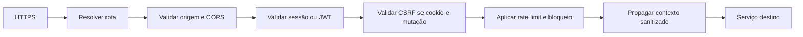

# Segurança e Políticas de Borda

[Responsabilidades](Responsabilidades%20do%20SC%20AG.md) · [Segurança compartilhada](../SC%20Ecossistema/Segurança%20Compartilhada.md)

## Pipeline de requisição

## Cookies e CSRF

Cookie é `HttpOnly`, `Secure` e `SameSite=Lax` ou mais restritivo. Seu domínio é mínimo. Em mutações, o gateway/BFF valida token CSRF não adivinhável; origem e referer podem ser sinais adicionais, não substitutos únicos.

## CORS

SC CP publica origens cadastradas para aplicação ativa. A chave de consulta inclui aplicação e, quando pertinente, tenant. Preflight negado não revela detalhes de contrato. Não existe allowlist global em variável de ambiente.

## Rate limit

A dimensão base é `tenant:application:ip`, complementada por identidade/cliente em rotas sensíveis. Login, OTP, webhooks e M2M possuem limites próprios. Resposta `429` inclui `Retry-After` quando possível.

## JWT e contexto

Validar assinatura por JWKS, `iss`, audience do destino, `exp`, `nbf`, `jti`, scopes e claims exigidos. Remover headers de identidade enviados pelo cliente antes de inserir headers internos assinados ou protegidos pela rede.

## Revogação

Revogação de cliente/chave é publicada e armazenada com TTL ao menos igual à validade máxima dos tokens afetados. Falha no canal de revogação gera alerta e política de falha fechada para operações críticas.

## Testes mínimos

- CORS de origem não cadastrada;
- CSRF ausente ou divergente;
- token de audience errada, expirado ou revogado;
- tenant no header diferente do contexto confiável;
- rate limit isolado entre tenants;
- segredo e token ausentes da telemetria.
