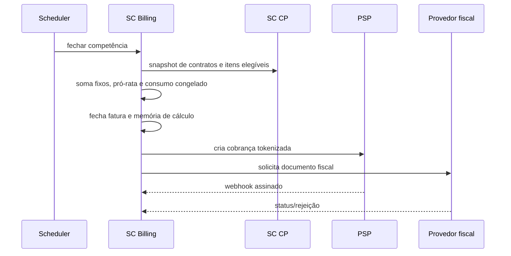

# Contratos e Fluxos do SC Billing

[Responsabilidades](Responsabilidades%20do%20SC%20Billing.md) · [Modelo](Modelo%20de%20Medição%20e%20Faturamento.md)

## Registro de consumo

Contrato conceitual: produtor envia tenant, recurso, quantidade, instante, referência de contrato e idempotency key. SC Billing resolve a versão de preço, congela valor/moeda e retorna referência do registro. A modelagem não aprova endpoint ou schema final.

## Fechamento

## Inadimplência

Após vencimento e grace period configurado, SC Billing publica estado auditável. SC CP suspende contrato conforme regra e SC AG aplica bloqueio. Pagamento/reconciliação publica desbloqueio; nenhum serviço apaga o histórico.

## Webhooks externos

Verificar assinatura, timestamp, conta/provedor, idempotência e transição. Persistir evento antes dos efeitos. Reconciliar periodicamente para detectar webhook perdido.

## Falhas obrigatórias

- rejeitar consumo sem contrato/recurso elegível;
- deduplicar evento repetido;
- impedir preço retroativo em consumo aceito;
- impedir fechamento concorrente da mesma competência;
- não marcar pago apenas por payload não verificado;
- registrar rejeição fiscal sem perder a fatura.

## Requisitos a formalizar

IDs próprios para consumo, tabela de preço, fechamento, fatura, PSP, fiscal, reajuste, inadimplência, estorno e reconciliação.
