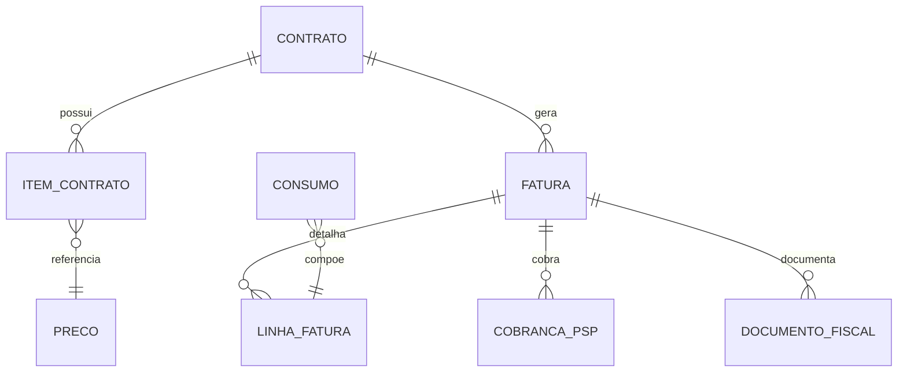

# Modelo de Medição e Faturamento

[Responsabilidades](Responsabilidades%20do%20SC%20Billing.md)

## Entidades

| Entidade | Conteúdo | Regra |
| --- | --- | --- |
| Contrato master | Tenant, ciclo, vencimento e status lógico | Fonte comercial no SC CP; referência no Billing |
| Item de contrato | Recurso, mensalidade, adesão e encerramento | Pró-rata conforme política |
| Preço | Recurso, moeda, valor e início de vigência | Imutável após uso; nova versão para reajuste |
| Consumo | Tenant, recurso, quantidade, preço congelado, instante | Idempotente e auditável |
| Competência | Janela de apuração | Fecha uma vez; reabertura controlada |
| Fatura | Totais, status, vencimento e memória | Ajustes por lançamento separado |
| Cobrança PSP | ID externo, estado e tentativas | Sem dados de cartão |
| Documento fiscal | Referência, status e rejeições | Emitido por provedor especializado |

## Relações

## Cálculo

- item fixo usa preço contratado e pró-rata conforme dias elegíveis;
- consumo usa `quantidade × valor_unitario_congelado`;
- arredondamento ocorre por política única, registrada na memória;
- total resulta de linhas, descontos, créditos e tributos explícitos;
- reajuste cria nova versão de preço com vigência futura.

## Estados candidatos

Fatura: `OPEN`, `CLOSED`, `ISSUED`, `PAID`, `OVERDUE`, `CANCELLED`. Cobrança e documento fiscal possuem estados próprios. Os catálogos finais precisam ser aprovados antes de virar API.

## Reconciliação

Comparar eventos de consumo com produtores, faturas com PSP e documentos com provedor fiscal. Divergência cria ocorrência operacional; nunca corrigir histórico silenciosamente.
