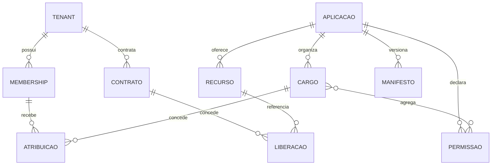

# Modelo de Domínio do SC CP

[Responsabilidades](Responsabilidades%20do%20SC%20CP.md)

## Agregados principais

| Agregado | Função | Estados/regras essenciais |
| --- | --- | --- |
| Tenant | Organização beneficiária ou fornecedora | Ativo para operar; identificado por subdomínio |
| Membership | Vínculo identidade–tenant | `OWNER`, `ADMIN`, `MEMBER`; soft-delete e bloqueio |
| Aplicação | Produto integrado | Ativa/inativa; exclusiva ou multi-tenant |
| Recurso | Unidade contratável/autorizável | Pertence a aplicação e precisa estar ativo |
| Contrato/liberação | Direito de uso | Ativo, suspenso ou encerrado; vincula tenant e recurso |
| Permissão | Capacidade estável | Chave no padrão `<app>.<grupo>.<ação>` |
| Cargo | Conjunto de permissões por aplicação/tenant | Pode ser atribuído somente dentro do escopo autorizado |
| Atribuição | Membership–aplicação–cargo | Todos os vínculos precisam estar ativos |
| Manifesto | Snapshot declarativo | `schemaVersion=1`, prévia, hash e aplicação controlada |
| Credencial técnica | Identidade de integração | BFF, catálogo e OIDC permanecem separadas |

## Relações

## Manifesto

O manifesto contém `schemaVersion`, `applicationKey`, `version`, permissões e rotas. Chaves de permissão são únicas; cada rota referencia permissão do mesmo manifesto; rota API exige método; unicidade usa `(kind, method, path)`.

Aplicação é em duas etapas: criar prévia e aplicar exatamente o `hash` pendente. Itens ausentes são inativados; nunca remover item usado sem avaliar cargos e acessos.

## Aplicação exclusiva

- owner e beneficiário são tenants distintos;
- contratos de outros beneficiários são rejeitados;
- não se altera exclusividade com liberação conflitante ativa;
- sessão ignora `tenantSubdominio` informado e usa o beneficiário cadastrado.

## Identidade lógica

`Membership.id_usuario_logico` referencia o SC SSO sem FK física. Eventos atualizam o estado local; reconciliação periódica detecta divergência. O SC CP guarda somente identificador e dados de negócio necessários, nunca credenciais.

## Regras de autorização administrativa

Capabilities `MEMBERS_MANAGE` e `RBAC_MANAGE` autorizam classes de ação administrativa. O ator também precisa ter permissão efetiva e não pode delegar além do próprio alcance.

## Lacunas

- O ERD físico completo e constraints de unicidade precisam ser confirmados no código/migrations.
- Estados formais de contrato, recurso, cargo e atribuição precisam de catálogo único.
- Estratégia de concorrência do manifesto e retenção das prévias ainda deve ser documentada.
