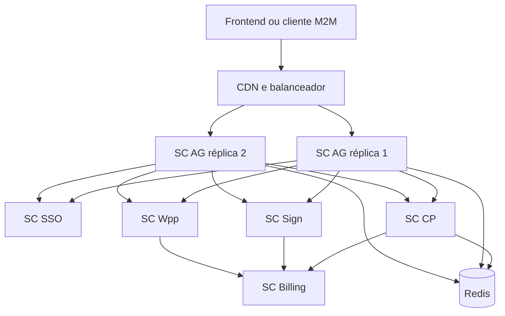
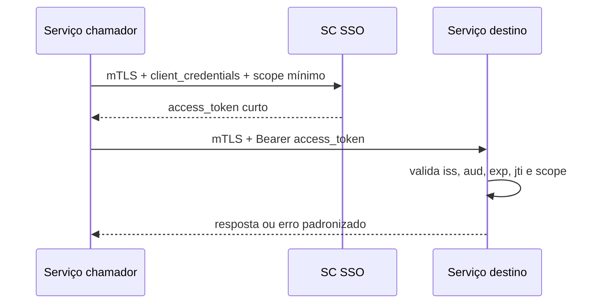

# Arquitetura e Integrações Entre Serviços

[Voltar à visão geral](Visão%20Geral%20do%20Ecossistema%20SC.md)

## Objetivo

Este documento descreve apenas relações que atravessam limites de serviço: topologia, ownership de dados, autenticação entre serviços, propagação de contexto e eventos. Regras internas permanecem na pasta do serviço proprietário.

## Topologia lógica

Cada serviço mantém banco próprio. Redis distribui políticas e estado efêmero; não substitui as fontes persistentes.

## Ownership de dados

| Informação | Proprietário | Consumidores | Forma de compartilhamento |
| --- | --- | --- | --- |
| Identidade, credenciais e MFA | SC SSO | SC AG, SC CP | Token validado e eventos de ciclo de vida |
| Tenant, membership e capabilities | SC CP | SC SSO, SC AG, aplicações | Contexto autorizado, APIs e eventos |
| Contrato, liberação, catálogo e RBAC | SC CP | SC AG, aplicações, Billing | APIs, manifesto e políticas publicadas |
| Política CORS, rate limit e revogação recente | SC CP | SC AG | Redis com versão, TTL e invalidação |
| Sessão/cookie de borda | SC AG | Browser e serviços de autenticação | Cookie opaco e chamadas protegidas |
| Documento e evidência de assinatura | SC Sign | Cliente autorizado, auditoria | API protegida e eventos de consumo |
| Mensagem e estado de entrega | SC Wpp | Solicitante, SSO, auditoria | API, fila e webhooks |
| Consumo, preço e fatura | SC Billing | SC CP, financeiro | Eventos idempotentes e APIs financeiras |

## Identidade lógica no domínio de negócio

O SC CP referencia a identidade por `id_usuario_logico`; não acessa senha, MFA ou dados secretos do SC SSO. Não existe FK física entre os bancos.

| Evento do SC SSO | Efeito esperado no SC CP |
| --- | --- |
| `USER_CREATED` | Registrar stub/evento de sincronização sem conceder acesso. |
| `USER_ACTIVATED` | Liberar o processamento de memberships pendentes, se as regras de negócio permitirem. |
| `USER_BLOCKED` | Bloquear memberships e acesso efetivo. |
| `USER_SOFT_DELETED` | Inativar memberships com soft-delete e preservar auditoria. |
| `USER_MERGED` | Substituir o identificador lógico por operação controlada. |

Um reconciliador periódico detecta eventos perdidos e vínculos órfãos. Recriar um usuário com o mesmo e-mail gera nova identidade; o vínculo antigo permanece histórico.

## Comunicação service-to-service

O alvo arquitetural combina duas provas:

1. mTLS identifica a carga de trabalho e protege o canal;
2. OAuth2 `client_credentials` emite token curto com audience e scopes mínimos.

Certificados devem durar no máximo 90 dias e ter renovação automática. Chaves privadas, client secrets e tokens não podem aparecer em logs ou pipelines. Revogação usa CRL/OCSP para certificados e invalidação publicada para credenciais/tokens.

## Fluxo de usuário web

O navegador nunca recebe senha da SC além do trânsito para o endpoint local de login, nem access token, refresh token, segredo técnico ou `sessionId` remoto. O BFF mantém sessão própria em cookie `HttpOnly`.

O contrato real atual documentado pela skill `sc` é:

1. o BFF autentica-se com credencial BFF por HTTP Basic;
2. cria sessão em `POST /api/v1/integracoes/sessoes` ou `/google`;
3. guarda no servidor o `sessionId` opaco e o contexto mínimo;
4. revalida com `GET /api/v1/integracoes/sessoes/{sessionId}`;
5. revoga com `DELETE /api/v1/integracoes/sessoes/{sessionId}`.

Aplicações não exclusivas enviam `tenantSubdominio`. Aplicações exclusivas deixam a SC resolver o tenant beneficiário.

O alvo arquitetural da V4 adiciona SC AG e SC SSO como serviços separados com OIDC `authorization_code` + PKCE. A alocação definitiva dos endpoints reais entre SC CP, SC AG e SC SSO precisa ser decidida durante a extração dos serviços; até lá, os paths acima são contratos da Software Center, não de um novo host presumido.

## Contexto de autorização

Tokens OIDC validados podem transportar:

- `sub` para a identidade;
- `tenant_id` e `tenant_subdomain`;
- `membro_tenant_id` para membership — não usar `membership_id` em JWT;
- `application_id`;
- `role_id`, `role_name` e `role_icon`;
- `permissions` e `capabilities`;
- `jti`, `iss`, `aud`, `iat` e `exp`.

O token não substitui revalidação quando a operação é sensível ou quando contrato, membership ou atribuição podem ter sido revogados.

## M2M e licenças

Uma licença M2M vincula tenant, cliente técnico, contratos ativos, cargos e permissões. O token é curto e reflete o estado no momento da emissão. Rolling keys permitem sobreposição controlada; revogação inativa a chave, invalida cache e faz o SC AG rejeitar tokens derivados conforme a política de revogação recente.

Clientes internos também usam o fluxo técnico. Qualquer isenção de faturamento para cliente sistêmico deve ser explícita, auditável e não baseada em dado vindo do chamador.

## Matriz produtor-consumidor

| Produtor | Evento ou contrato | Consumidor | Resultado |
| --- | --- | --- | --- |
| SC SSO | Ciclo de vida da identidade | SC CP | Sincroniza acesso sem copiar credenciais |
| SC CP | Política versionada | SC AG | Atualiza CORS, rate limit e bloqueios |
| SC CP | Cliente/contrato autorizado | SC SSO | Emite token com audience e scopes permitidos |
| SC Sign | Consumo de assinatura | SC Billing | Registra quantidade e preço aplicável |
| SC Wpp | Consumo de mensagem | SC Billing | Registra consumo por canal/tipo |
| PSP | Webhook de cobrança | SC Billing | Atualiza pagamento idempotentemente |
| SC Billing | Estado de inadimplência | SC CP e SC AG | Suspende contrato e bloqueia acesso na borda |

## Decisões e lacunas

- A divisão física dos endpoints atuais da SC entre CP, SSO e AG ainda precisa de ADR e plano de migração.
- O contrato de eventos, incluindo schema, versionamento, idempotency key, retenção e replay, ainda não está publicado.
- A V4 cita token delegado e token exchange, mas a skill `sc` alerta que nem todo cliente OIDC possui grants e scopes `sc.*` habilitados.
- Não há OpenAPI publicado para todos os contratos descritos; validar contra o ambiente antes de implementar consumidor.
