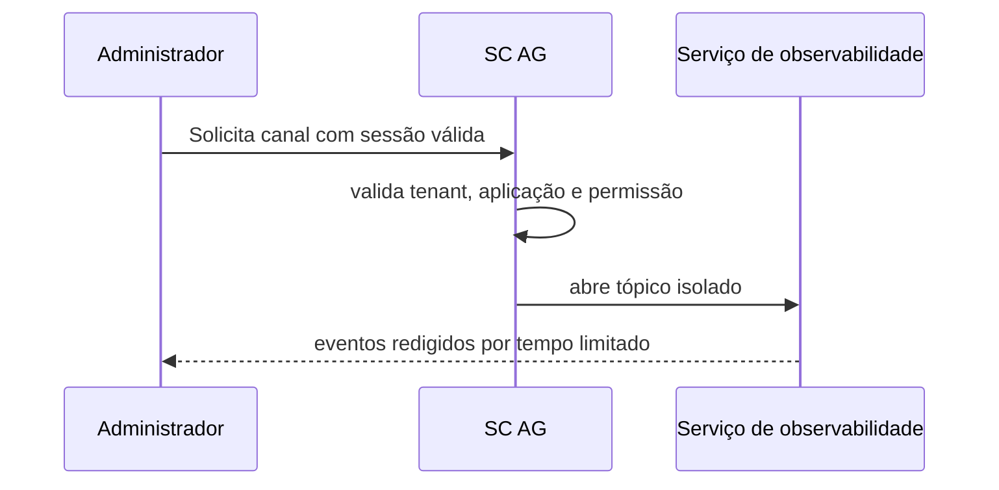

# Observabilidade, Disponibilidade e Operação

[Voltar à visão geral](Visão%20Geral%20do%20Ecossistema%20SC.md)

## Disponibilidade

O SC AG é um ponto de entrada lógico e deve executar com ao menos duas réplicas em zonas distintas. Serviços core e bancos exigem health checks, backup contínuo e procedimentos de failover coerentes com os SLOs.

| Falha | Comportamento esperado |
| --- | --- |
| Réplica do SC AG | Balanceador remove a réplica; tráfego segue para instâncias saudáveis. |
| Redis | SC AG usa último snapshot local versionado durante grace period; mutações de política aguardam reconciliação. |
| SC SSO | Novos logins falham com `503`; sessões ainda verificáveis podem seguir apenas dentro da política de risco. |
| SC CP | Operações de negócio falham fechadas; cache não cria nova autorização. |
| Provedor externo | Circuit breaker abre; fila retém trabalho e fallback é aplicado quando previsto. |
| Zona de disponibilidade | Tráfego e dados recuperam em outra zona dentro do RTO/RPO. |

O modo degradado nunca transforma dado antigo em nova permissão. Em dúvida de autorização, falhar fechado.

## Redis e cache

Chaves devem incluir versão de schema e dimensões de isolamento, como tenant e aplicação. Cada entrada tem TTL; invalidação reduz a janela de inconsistência, mas não substitui expiração. O cache local do SC AG é reserva temporária e deve registrar idade e versão.

## Observabilidade

| Camada | Padrão |
| --- | --- |
| Logs | JSON estruturado, com `request_id`, serviço e tenant redigido quando necessário |
| Métricas | Prometheus/Grafana ou equivalente, com cardinalidade controlada |
| Traces | OpenTelemetry entre SC AG, serviços, Redis, filas e bancos |
| Alertas | P1 para indisponibilidade/isolamento; P2 para latência/degradação; P3 para tendência de erros |

Segredos, OTPs, tokens, `sessionId`, conteúdo de documentos e payloads integrais não entram em telemetria.

## Telemetria em tempo real

O canal WebSocket é ativado sob demanda e exige permissão como `observability.read`. O handshake valida contexto antes de abrir o canal; cada tópico é isolado por tenant e sessão. Aplicam-se rate limit, buffer curto e redação obrigatória.

## Metas não funcionais

| ID | Meta | Evidência |
| --- | --- | --- |
| NFR-01 | Disponibilidade de 99,9% | SLO e testes de failover |
| NFR-02 | Preflight CORS P99 menor que 10 ms | Teste de carga e métrica Redis/cache |
| NFR-03 | Overhead do SC AG P99 menor que 50 ms | Trace distribuído |
| NFR-04 | Zero segredo em logs/repositório | Secret scan e regras de logging |
| NFR-05 | Zero acesso cross-tenant | Suíte negativa multi-tenant |
| NFR-06 | 100% dos eventos de assinatura auditados | Reconciliação de trilha |
| NFR-07 | RTO de até 15 minutos após falha de zona | Game day |
| NFR-08 | RPO de até 5 minutos | Restauração validada |

## Ambientes

Produção usa HTTPS, mTLS, dados reais, rate limit rígido e contratos ativos. Sandbox usa credenciais e dados separados, aceita localhost conforme configuração explícita e mantém rate limit suficiente para impedir abuso. Sandbox monetizado não compartilha bancos ou segredos com produção.

## Runbooks mínimos

- Failover de zona e retirada de réplica.
- Indisponibilidade e recuperação do Redis.
- Rotação emergencial de certificados e segredos.
- Revogação de cliente M2M comprometido.
- Pausa e replay seguro de filas.
- Restauração de banco e validação de RPO.
- Incidente de vazamento cross-tenant.

## Decisões e lacunas

- Ferramentas citadas na V4 são sugestões, não dependências contratadas.
- TTLs, grace periods, thresholds de circuit breaker e cardinalidade de métricas precisam de valores por ambiente.
- A arquitetura do serviço de observabilidade e seu armazenamento de longo prazo ainda não foi definida.
