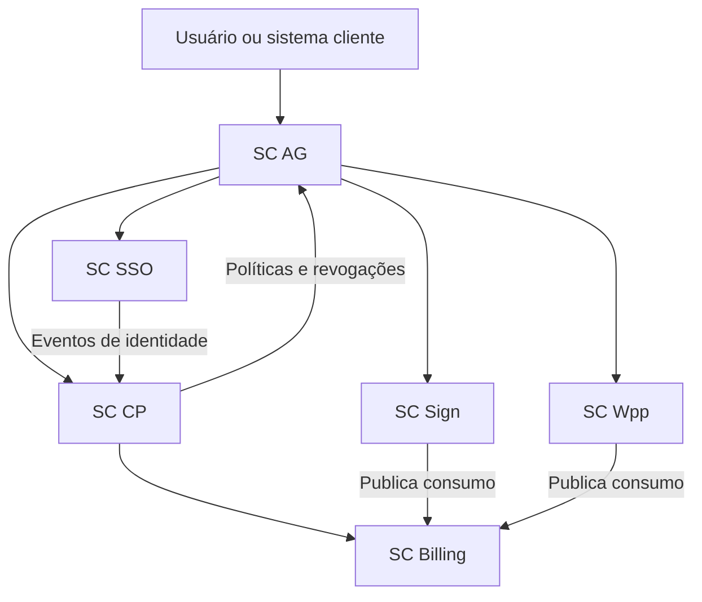

# Visão Geral do Ecossistema Software Center

## Status e finalidade

Esta é a porta de entrada da documentação modular do ecossistema Software Center. Os documentos desta árvore são a referência operacional para análise, implementação e manutenção. Os quatro planos de ação originais permanecem imutáveis como histórico da evolução arquitetural.

### Precedência das fontes

1. Contratos reais descritos pela skill geral `sc` e confirmados no código da Software Center.
2. Decisões arquiteturais consolidadas no Plano de Ação V4.
3. Planos V1 a V3 apenas como contexto histórico ou fonte não contraditória.

Quando faltar um contrato, o documento registra a lacuna. A ausência nunca autoriza inventar endpoint, claim, scope, estado ou regra de negócio.

## Mapa de responsabilidades

| Serviço | Responsabilidade principal | Fonte de verdade |
| --- | --- | --- |
| **SC CP** | Tenants, memberships, contratos, catálogo, aplicações, manifesto e RBAC | Dados de negócio e acesso contratado |
| **SC SSO** | Identidades, autenticação, OAuth2/OIDC, MFA, sessões e tokens | Identidade e credenciais |
| **SC AG** | Proxy de segurança, sessão de borda, CSRF, CORS, rate limit e resiliência | Políticas em cache; não é fonte primária de identidade ou negócio |
| **SC Sign** | Documentos, assinaturas, evidências, auditoria e verificação | Evidência da assinatura |
| **SC Wpp** | Entrega de mensagens, templates, consentimento, webhooks e fallback | Estado operacional da entrega |
| **SC Billing** | Medição, preços, competência, fechamento e faturamento consolidado | Registros financeiros e de consumo |

## Documentação transversal

- [Arquitetura e Integrações Entre Serviços](Arquitetura%20e%20Integrações%20Entre%20Serviços.md)
- [Segurança Compartilhada](Segurança%20Compartilhada.md)
- [Observabilidade, Disponibilidade e Operação](Observabilidade,%20Disponibilidade%20e%20Operação.md)
- [Requisitos e Rastreabilidade](Requisitos%20e%20Rastreabilidade.md)
- [Roadmap e Riscos](Roadmap%20e%20Riscos.md)

## Documentação por serviço

### SC CP

- [Responsabilidades do SC CP](../SC%20CP/Responsabilidades%20do%20SC%20CP.md)
- [Modelo de Domínio do SC CP](../SC%20CP/Modelo%20de%20Domínio%20do%20SC%20CP.md)
- [Contratos e Fluxos do SC CP](../SC%20CP/Contratos%20e%20Fluxos%20do%20SC%20CP.md)

### SC SSO

- [Responsabilidades do SC SSO](../SC%20SSO/Responsabilidades%20do%20SC%20SSO.md)
- [Modelo de Identidade do SC SSO](../SC%20SSO/Modelo%20de%20Identidade%20do%20SC%20SSO.md)
- [Contratos e Fluxos de Autenticação](../SC%20SSO/Contratos%20e%20Fluxos%20de%20Autenticação.md)

### SC AG

- [Responsabilidades do SC AG](../SC%20AG/Responsabilidades%20do%20SC%20AG.md)
- [Segurança e Políticas de Borda](../SC%20AG/Segurança%20e%20Políticas%20de%20Borda.md)
- [Roteamento, Cache e Resiliência](../SC%20AG/Roteamento,%20Cache%20e%20Resiliência.md)

### SC Sign

- [Responsabilidades do SC Sign](../SC%20Sign/Responsabilidades%20do%20SC%20Sign.md)
- [Modelo de Assinatura e Evidências](../SC%20Sign/Modelo%20de%20Assinatura%20e%20Evidências.md)
- [Contratos e Fluxos do SC Sign](../SC%20Sign/Contratos%20e%20Fluxos%20do%20SC%20Sign.md)

### SC Wpp

- [Responsabilidades do SC Wpp](../SC%20Wpp/Responsabilidades%20do%20SC%20Wpp.md)
- [Entrega, Retentativas e Fallbacks](../SC%20Wpp/Entrega,%20Retentativas%20e%20Fallbacks.md)
- [Contratos, Webhooks e Consentimento](../SC%20Wpp/Contratos,%20Webhooks%20e%20Consentimento.md)

### SC Billing

- [Responsabilidades do SC Billing](../SC%20Billing/Responsabilidades%20do%20SC%20Billing.md)
- [Modelo de Medição e Faturamento](../SC%20Billing/Modelo%20de%20Medição%20e%20Faturamento.md)
- [Contratos e Fluxos do SC Billing](../SC%20Billing/Contratos%20e%20Fluxos%20do%20SC%20Billing.md)

## Skills do repositório

- [`sc-cp`](../.agents/skills/sc-cp/SKILL.md) — tenants, contratos, catálogo, manifesto e RBAC.
- [`sc-sso`](../.agents/skills/sc-sso/SKILL.md) — identidade, autenticação, OAuth2/OIDC, MFA e tokens.
- [`sc-ag`](../.agents/skills/sc-ag/SKILL.md) — proxy, cookies, CORS, rate limit, cache e resiliência.
- [`sc-sign`](../.agents/skills/sc-sign/SKILL.md) — documentos, assinaturas, evidências e verificação.
- [`sc-wpp`](../.agents/skills/sc-wpp/SKILL.md) — WhatsApp Cloud API, consentimento, filas e webhooks.
- [`sc-billing`](../.agents/skills/sc-billing/SKILL.md) — medição, preços, fechamento, cobrança e reconciliação.

## Histórico preservado

- [Plano de Ação original](../Plano%20de%20Ação%20-%20Ecossistema%20Software%20Center%20%28SC%29.md)
- [Plano de Ação V2](../Plano%20de%20Ação%20V2%20-%20Ecossistema%20Software%20Center%20%28SC%29.md)
- [Plano de Ação V3](../Plano%20de%20Ação%20V3%20-%20Ecossistema%20Software%20Center%20%28SC%29.md)
- [Plano de Ação V4](../Plano%20de%20Ação%20V4%20-%20Ecossistema%20SoftwareCenter%20%28SC%29.md)

## Glossário essencial

| Termo | Definição |
| --- | --- |
| BFF | Backend-for-Frontend que mantém a sessão própria de uma aplicação cliente. |
| Membership | Vínculo entre identidade e tenant, com papel e capabilities administrativas. |
| Manifesto | Declaração versionada das permissões e rotas de uma aplicação. |
| Atribuição | Vínculo entre membership, aplicação e cargo. |
| M2M | Integração entre sistemas por credencial técnica e token de curta duração. |
| TSA | Time-Stamping Authority usada para prova de existência temporal. |
| PSP | Provedor externo de serviços de pagamento. |

## Regra de navegação

Comece pelo documento de responsabilidades do serviço. Leia o modelo quando a mudança afetar dados ou estados. Leia contratos e fluxos para integrações. Para qualquer decisão que envolva mais de um serviço, consulte primeiro a documentação transversal.
