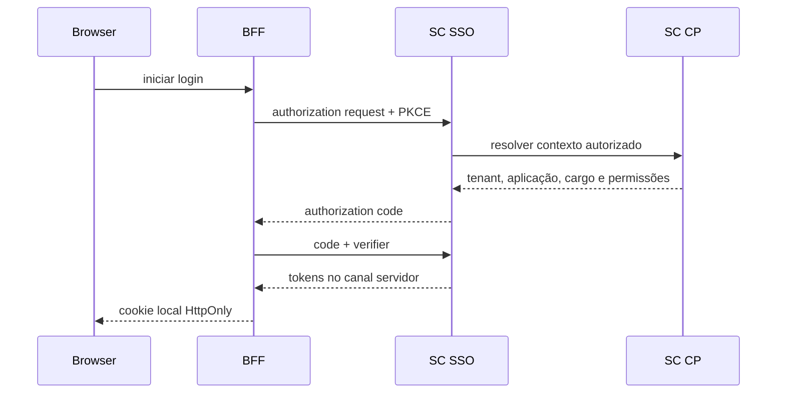

# Contratos e Fluxos de Autenticação

[Responsabilidades](Responsabilidades%20do%20SC%20SSO.md) · [Modelo](Modelo%20de%20Identidade%20do%20SC%20SSO.md)

## Sessão BFF atual

| Operação | Contrato atual |
| --- | --- |
| Login com senha | `POST /api/v1/integracoes/sessoes` |
| Login Google | `POST /api/v1/integracoes/sessoes/google` |
| Revalidar | `GET /api/v1/integracoes/sessoes/{sessionId}` |
| Revogar | `DELETE /api/v1/integracoes/sessoes/{sessionId}` |

O BFF usa HTTP Basic, persiste `sessionId` apenas no servidor e emite cookie local seguro. Revalidação não renova automaticamente a sessão SC.

## Identidade pública atual

- `POST /api/v1/public/cadastro` cria identidade `PENDING`;
- `POST /api/v1/public/verificacoes-email` ativa após token válido;
- `POST /api/v1/public/recuperacoes-senha` sempre responde `202` de forma genérica;
- `POST /api/v1/public/recuperacoes-senha/verificacoes` valida OTP;
- `POST /api/v1/public/redefinicoes-senha` troca senha e encerra sessões existentes;
- endpoints de ativação consultam, concluem cadastro ou aceitam convite autenticado.

## OIDC alvo

## MFA

SC SSO cria o desafio e o OTP. TOTP é validado internamente; WhatsApp/e-mail são entregues por canal autorizado. SC Wpp nunca cria nem valida o segredo.

## Token delegado

Token para RBAC usa audience `sc-management`, TTL curto, `application_id` coerente e scopes `sc.members.read`, `sc.rbac.read` ou `sc.rbac.write`. A emissão exige `RBAC_MANAGE` e configuração de grant; não presumir disponibilidade universal.

## Falhas

- `401` para autenticação inválida;
- `403` para acesso efetivo ausente sem detalhar a causa;
- `429` para tentativas excessivas;
- `503` quando provedor necessário estiver indisponível.

## Decisões e lacunas

Os paths acima são contratos atuais da Software Center. A mudança de host/path para um SC SSO independente exige compatibilidade, migração e OpenAPI; este documento não presume essa alteração.
