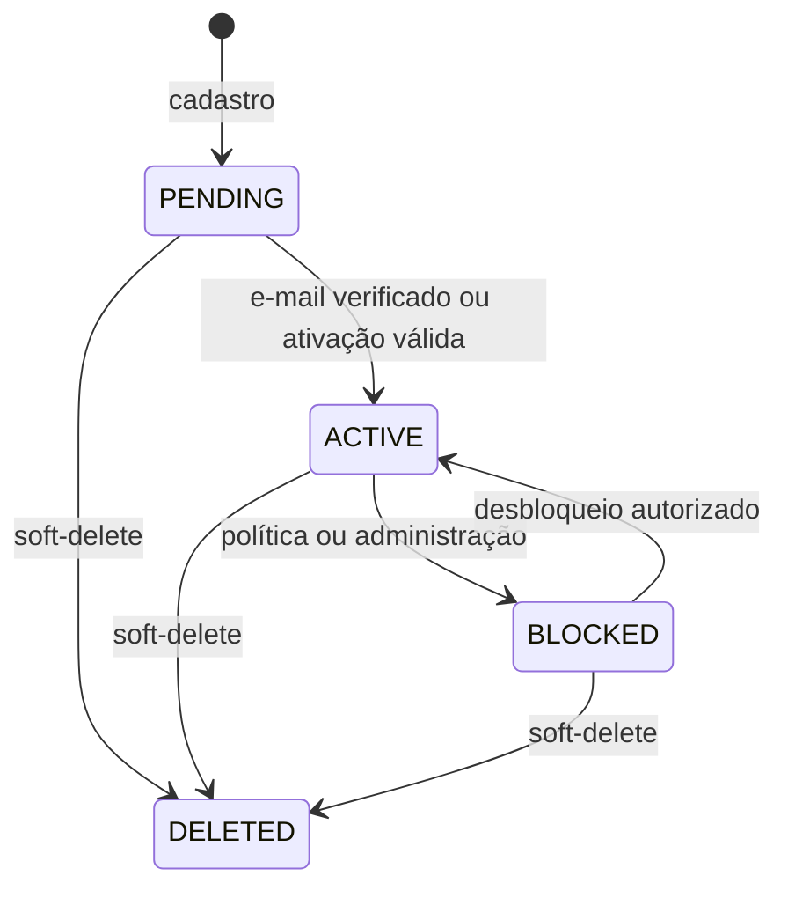

# Modelo de Identidade do SC SSO

[Responsabilidades](Responsabilidades%20do%20SC%20SSO.md)

## Entidades

| Entidade | Dados essenciais | Regras |
| --- | --- | --- |
| Usuário | ID, e-mail normalizado, senha hash, status, verificação | E-mail único; soft-delete |
| Cliente OAuth2 | client ID, secret hash, grants, scopes, redirects | Segredo exibido uma vez |
| Sessão de autenticação | ID opaco, usuário, cliente, expiração | Revogável; não exposta ao browser |
| Refresh token | hash, usuário, família, expiração, rotação | Reuso revoga a família |
| Desafio MFA | ID, canal, secret hash, expiração, tentativas | Uso único e limite de tentativas |
| Chave de assinatura | KID, material protegido, vigência | Rotação com sobreposição JWKS |
| Credencial técnica | cliente, tenant/licença lógica, status | Rolling keys e revogação |

## Estados da identidade

## Claims de contexto

Além dos claims OIDC padrão, o token pode incluir `tenant_id`, `tenant_subdomain`, `membro_tenant_id`, `application_id`, cargo, permissões e capabilities. O claim de membership é `membro_tenant_id`.

Claims de negócio são snapshots de curta duração, não cópias permanentes. Serviços sensíveis revalidam quando a revogação imediata for requisito.

## Separação de clientes

- OIDC de usuário: `authorization_code` + PKCE e, se autorizado, `refresh_token`.
- Catálogo: `client_credentials`, audience `sc-catalog`, scope `sc.catalog.sync`.
- BFF: HTTP Basic apenas para as APIs atuais de sessão.
- M2M: `client_credentials`, audience do recurso e scopes mínimos.

Segredos não são reutilizados entre tipos.

## Lacunas

- Algoritmo de senha, política de força e recuperação precisam ser confirmados na implementação.
- Duração de tokens, rotação de KID e detecção de reuse precisam de valores operacionais.
- Canais MFA habilitados e fallback devem ser configuráveis por política, sem enfraquecer o fator exigido.
