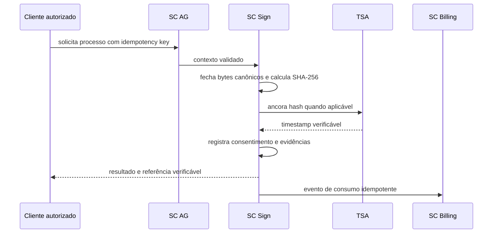

# Contratos e Fluxos do SC Sign

[Responsabilidades](Responsabilidades%20do%20SC%20Sign.md) · [Modelo](Modelo%20de%20Assinatura%20e%20Evidências.md)

## Fluxo principal

## Contratos conceituais

| Operação | Entrada mínima | Saída mínima |
| --- | --- | --- |
| Criar processo | contexto, documento/dados, signatários, modalidade, idempotency key | ID, hash, versão e status |
| Registrar assinatura | processo, signatário autenticado, consentimento | evento e status atualizado |
| Consultar | ID e autorização | status e signatários permitidos |
| Verificar | documento ou referência | hash, timestamp e verificações executadas |
| Cancelar | ID, ator autorizado e motivo | evento de cancelamento |

Nenhum path HTTP, schema final ou código de status específico está aprovado na modelagem atual.

## Falhas obrigatórias

- negar tenant ou signatário divergente;
- rejeitar documento diferente do hash registrado;
- não completar processo quando TSA obrigatória estiver indisponível;
- tratar repetição com mesma idempotency key sem duplicar processo/consumo;
- impedir cancelamento ou assinatura em estado terminal;
- nunca expor pacote de evidência sem autorização.

## Requisitos a formalizar

Criar IDs próprios para geração canônica, assinatura, verificação, cancelamento, timestamp, auditoria, idempotência, retenção e publicação de consumo.
