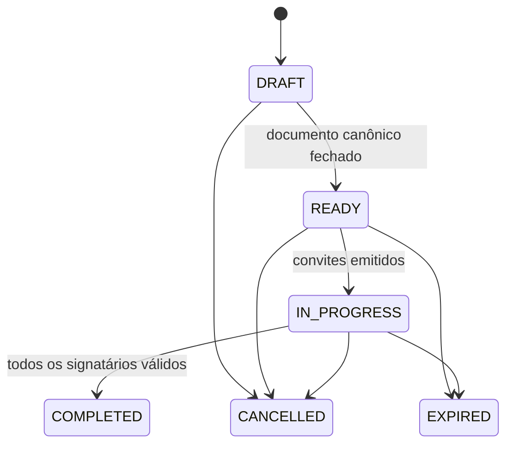
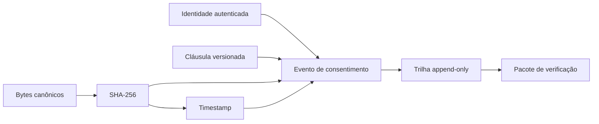

# Modelo de Assinatura e Evidências

[Responsabilidades](Responsabilidades%20do%20SC%20Sign.md)

## Entidades

| Entidade | Conteúdo | Regra |
| --- | --- | --- |
| Processo de assinatura | Tenant, solicitante, modalidade, status | Imutável quanto ao documento canônico |
| Documento | Bytes, versão, MIME type, hash SHA-256 | Nova versão gera novo hash |
| Signatário | ID lógico, papel, ordem e status | Identidade resolvida externamente |
| Consentimento | Texto/versionamento, aceite e instante | Vinculado ao documento e signatário |
| Evidência | IP permitido, user-agent, request ID e eventos | Append-only e redigida |
| Timestamp | Requisição/resposta TSA e validação | Associado ao hash exato |
| Pacote de verificação | Documento, cadeia de evidências e resultado | Exportável sem segredo |

## Estados sugeridos

Estados são modelo arquitetural, não contrato publicado. A implementação deve formalizá-los antes de expor API.

## Cadeia de evidência

## Retenção e privacidade

Guardar somente metadados necessários à prova e às obrigações definidas. A retenção, base legal, acesso do titular e descarte precisam de política jurídica e de privacidade. Logs operacionais não substituem a trilha de evidência.

## Lacunas

- Formato do documento canônico e normalização de PDF.
- Provedor TSA, validação da cadeia e comportamento em indisponibilidade.
- Formato assinado do pacote de evidência e armazenamento WORM.
- Modalidades legais oferecidas e uso de certificado ICP-Brasil.
