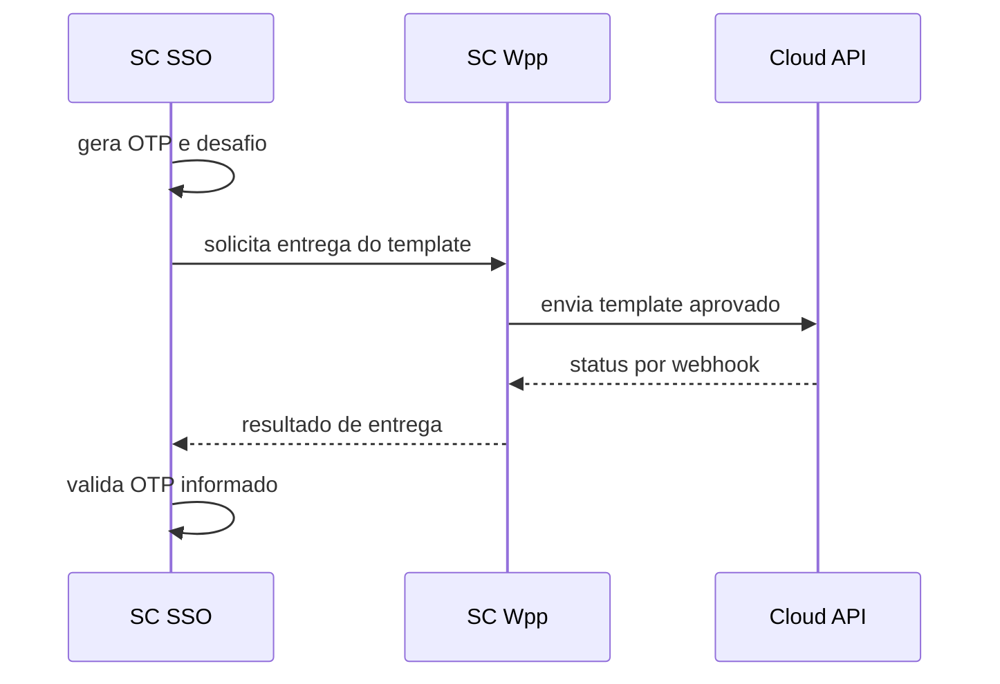

# Contratos, Webhooks e Consentimento

[Responsabilidades](Responsabilidades%20do%20SC%20Wpp.md) · [Entrega](Entrega,%20Retentativas%20e%20Fallbacks.md)

## Solicitação conceitual

Uma solicitação contém contexto autorizado, destinatário, template e idioma, parâmetros mínimos, finalidade, prioridade e idempotency key. Segredos do provedor nunca são enviados pelo consumidor.

O retorno contém ID interno, status aceito/rejeitado e correlação segura. A modelagem atual não aprova path ou schema HTTP final.

## Webhooks

1. Verificar assinatura e timestamp antes de ler o evento.
2. Deduplicar pelo identificador do provedor.
3. Correlacionar com mensagem e tenant sem aceitar tenant do payload como autoridade.
4. Aplicar apenas transição de estado válida.
5. Persistir evento redigido e responder rapidamente.
6. Processar efeitos, consumo e fallback de forma assíncrona e idempotente.

## Consentimento

Registrar finalidade, canal, origem, instante, versão do texto e eventual revogação. Revogação impede novos envios não obrigatórios; retenção do registro segue política jurídica. Templates de autenticação seguem política própria do SC SSO.

## Fluxo MFA

## Falhas

Rejeitar template inexistente, consentimento ausente, canal desabilitado, contexto divergente, assinatura de webhook inválida e repetição incompatível da mesma idempotency key.

## Requisitos a formalizar

IDs próprios para envio, status, consentimento, opt-out, webhook, retry, fallback, dead-letter e consumo.
