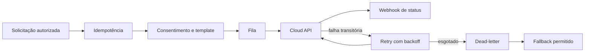

# Entrega, Retentativas e Fallbacks

[Responsabilidades](Responsabilidades%20do%20SC%20Wpp.md)

## Pipeline

## Estados operacionais

`QUEUED`, `SUBMITTED`, `SENT`, `DELIVERED`, `READ`, `FAILED`, `FALLBACK_PENDING`, `FALLBACK_SENT` e `DEAD_LETTER` são candidatos. Precisam ser formalizados com transições aceitas antes da API.

## Retry

- falha de rede, `429` ou `5xx` pode ser transitória;
- erro de template, consentimento ou destinatário inválido não deve repetir sem correção;
- respeitar `Retry-After` e limite do provedor;
- usar jitter e número máximo de tentativas;
- mensagem mantém a mesma idempotency key em todas as tentativas.

## Fallback

Fallback ocorre somente após classificação de falha, política do tenant e consentimento do canal alternativo. MFA não deve ser rebaixado para canal menos seguro sem política do SC SSO.

## Dead-letter e reconciliação

Mensagens esgotadas vão para dead-letter com motivo redigido. Reprocessamento é operação administrativa auditada e idempotente. Reconciliação compara estado local com o provedor sem duplicar consumo.

## Métricas

Taxa por estado, tempo de fila, latência até entrega, retries, dead-letter, fallback e rejeição por consentimento. Não usar telefone ou conteúdo como label.
